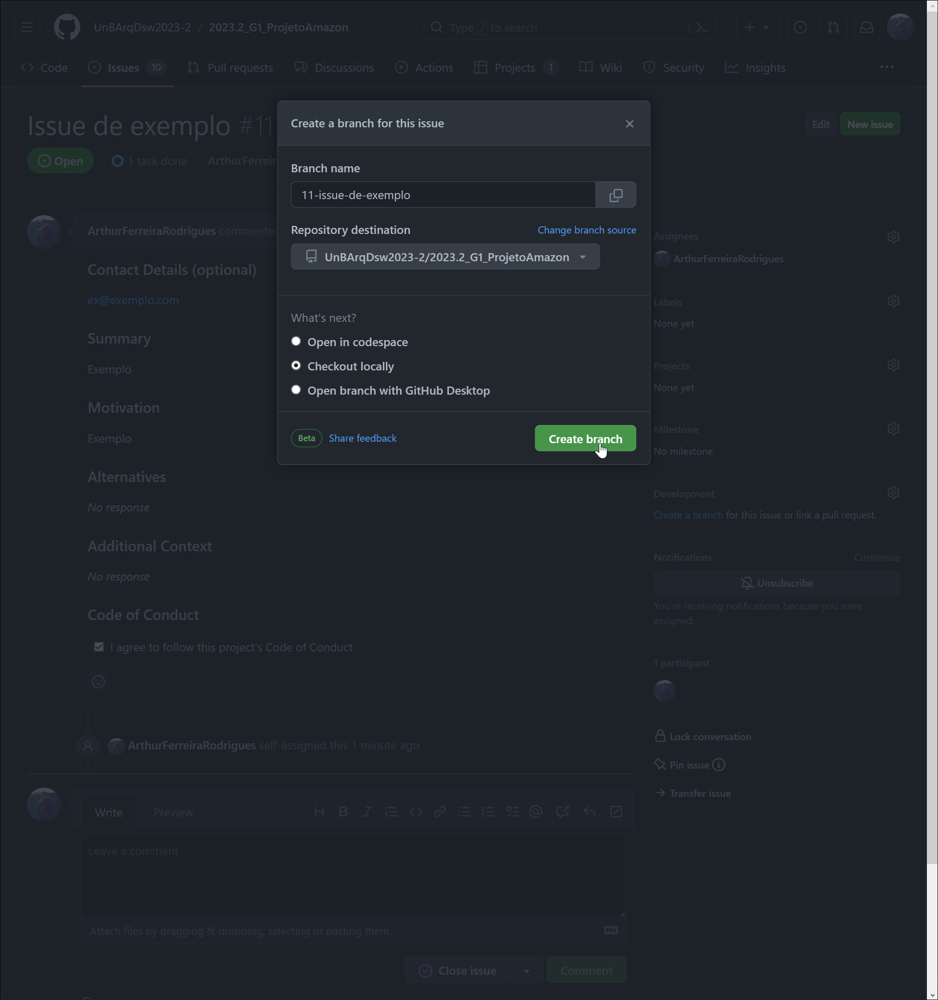
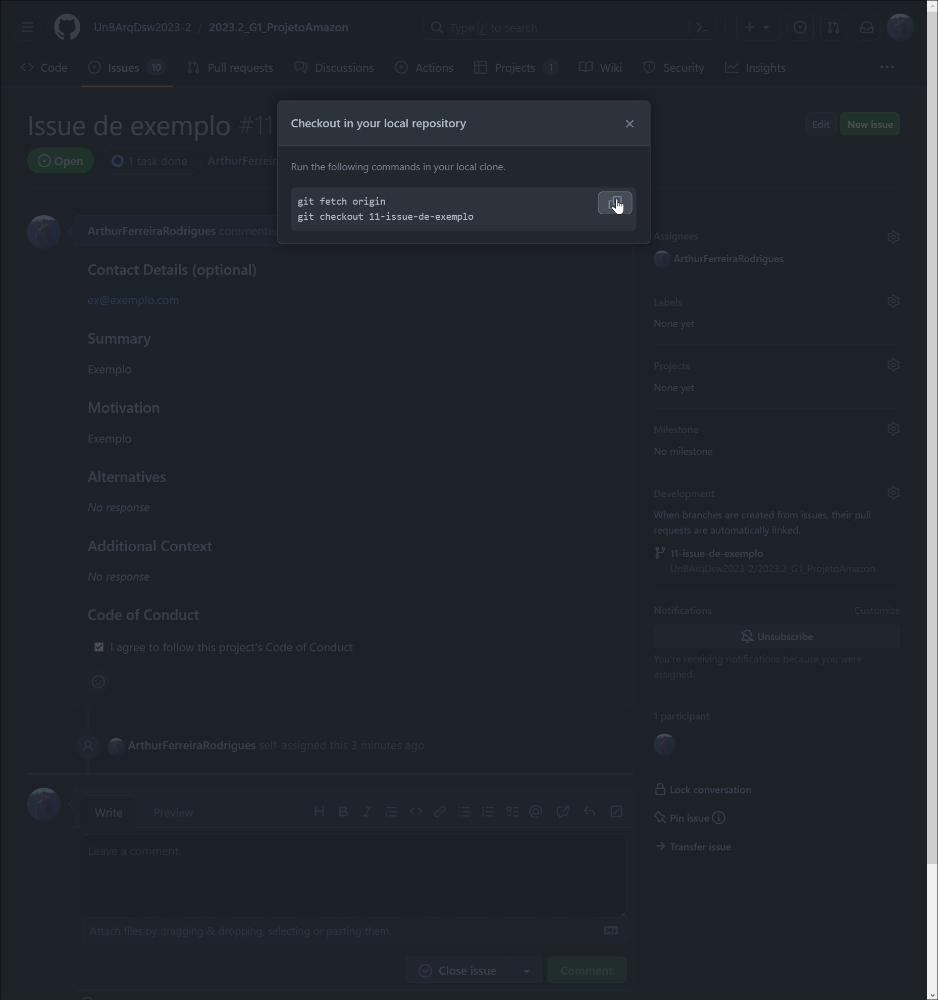
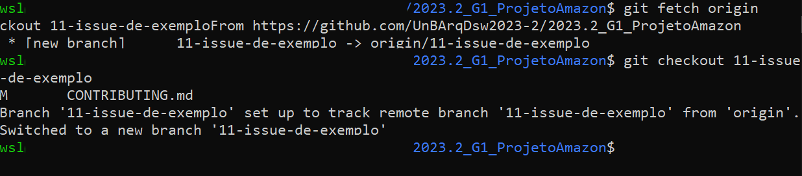

# Contributing

O primeiro passo para contribuir com o projeto é encontrar [issues abertas](https://github.com/UnBArqDsw2023-2/2023.2_G1_ProjetoAmazon/issues) que você deseje contribuir. Caso não encontre nenhuma issue que te agrade, você pode abrir uma nova issue para discutir sobre a funcionalidade que você deseja implementar, utilizando a label `feature request`.

Lembrando, antes de abrir uma nova issue, verifique se já não existe uma issue aberta com o mesmo propósito. Além disso, há um [Código de Conduta](CODE_OF_CONDUCT.md) que deve ser seguido por todos os contribuidores do projeto.

## Desenvolvimento

O fluxo pode ser diferente caso você seja um contribuidor externo ou um contribuidor interno.
### Contribuidores internos

Para contribuir com o projeto, você deve seguir o fluxo a seguir:

1. Atribuir a issue a si mesmo;
2. Caso não exista, criar uma branch específica para a issue, mantendo o nome sugerido; 
3. Copiar os comandos e executar no terminal;
4. Desenvolver a funcionalidade na nova branch;
5. Realizar o pull request para a branch `main` do projeto.

    

        
        
        
        
        
    

[Ex de contibuting](https://github.com/DNXLabs/terraform-aws-ecs/blob/master/CONTRIBUTING.md)