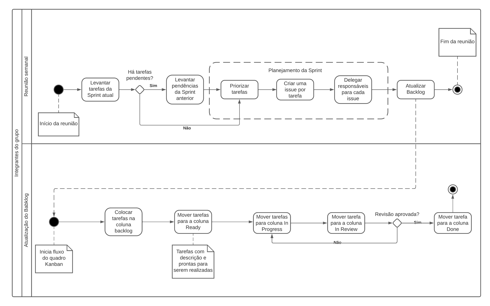
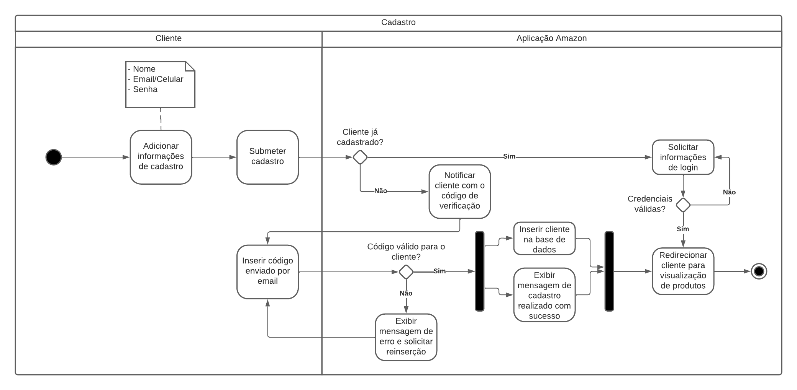
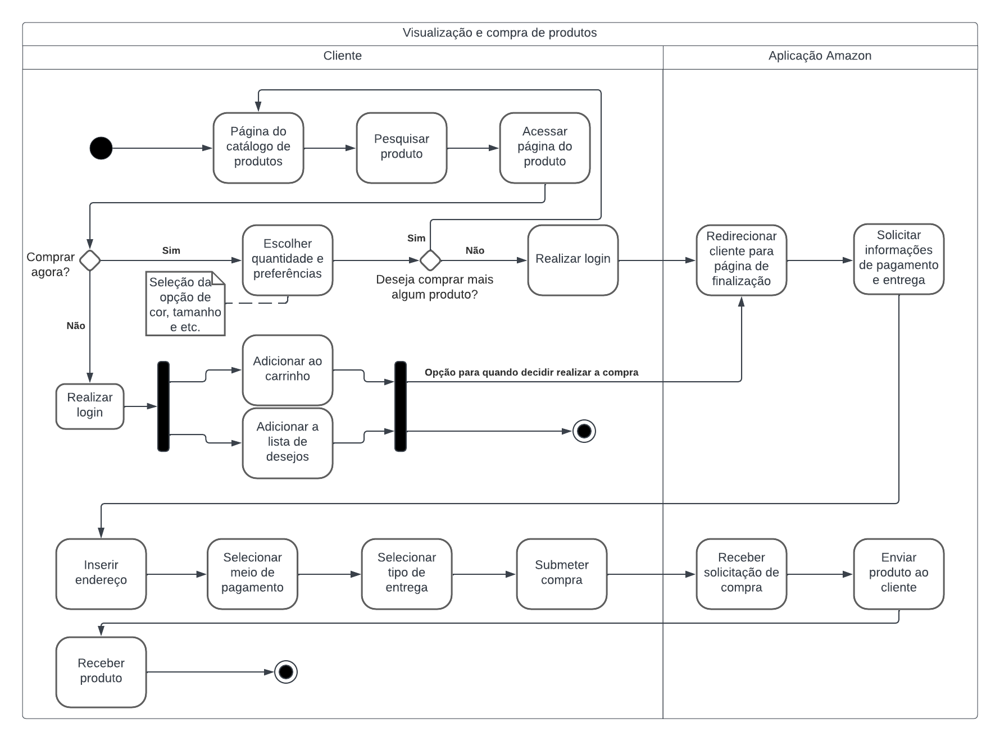

# Visão Arquitetural – Processo

## Introdução

 A visão de processo em um documento de arquitetura de software descreve os procedimentos, tarefas e sequências de trabalho envolvidos desde o início até a conclusão do ciclo de vida do software. Isso oferece uma visão de como as várias partes envolvidas no projeto interagirão e colaborarão para alcançar os objetivos estabelecidos para o desenvolvimento, manutenção e evolução do software.

Essa visão pode abranger os fluxos de trabalho, que representam a ordem lógica das atividades e suas interdependências. Os fluxos de trabalho podem ser apresentados por meio de diagramas de atividades, fluxogramas ou outras representações visuais que mostram como as atividades são realizadas e como as informações são compartilhadas entre os diferentes participantes do projeto.

## Metodologia

Durante a fase de modelagem, nossa equipe desenvolveu tanto o diagrama de sequência quanto o diagrama de atividades. Ao criar a documentação da visão de processos, utilizamos esses diagramas como base, mas fizemos algumas modificações e aprimoramentos para melhor atender às nossas necessidades e proporcionar uma representação mais clara e eficaz.

Para a criação dos diagramas, foi utilizado o site [LucidChart](https://www.lucidchart.com/), que é uma ferramenta online para criação de diagramas.

## Diagramas

### Diagrama de Sequência

O diagrama de sequência é um diagrama de interação que mostra como os processos operam com um foco em sequência. Ele mostra objetos, classes e componentes envolvidos nas operações e a sequência de mensagens trocadas entre os objetos necessários para realizar a funcionalidade da operação. [4]

 Diagrama de Sequência: Versão 2.0 (Fonte: Autores, 2023).</a>
 

### Diagrama de Atividades

Afim de especificar melhor os processos de gestão do grupo, cadastro de usuario, visualização e compra de produtos, na plataforma Amazon, foi aprimorada a diagramação UML proposta nas entregas anteriores. Assim, evidenciando de forma mais clara os passos e tarefas presentes nestes fluxos.

### Processo de gestão da equipe

 Diagrama de Atividades - Gestão: Versão 2.0 (Fonte: Autores, 2023).</a>
 

#### Processo de cadastro de usuário

 Diagrama de Atividades - Cadastro: Versão 2.0 (Fonte: Autores, 2023).</a>
 

#### Processo de compra na plataforma

 Diagrama de Atividades - Compra: Versão 2.0 (Fonte: Autores, 2023).</a>
 

## Bibliografia

> [1] AULA - ARQUITETURA & DAS – PARTE II. Serrano, Milene. Disponível em: [Aprender3](https://aprender3.unb.br/pluginfile.php/2649469/mod_label/intro/Arquitetura%20e%20Desenho%20de%20Software%20-%20Aula%20Arquitetura%20e%20DAS%20-%20Parte%20II%20-%20Profa.%20Milene.pdf). Acesso em: 25 nov 2023.
>
> [2] Conheça a Visão de processo no modelo-visão 4+1 de Kruchten. Disponível em: [Youtube](https://www.youtube.com/watch?v=ZZVEEjeikY8). Acesso em: 25 nov 2023.
>
> [3]Architectural Blueprints—The “4+1” View
Model of Software Architecture. Disponível em: [cs.ubc.ca](https://www.cs.ubc.ca/~gregor/teaching/papers/4+1view-architecture.pdf). Acesso em: 25 nov 2023. 
>
> [4] O que é um diagrama de sequência UML?. Disponivel em: [lucidchart](https://www.lucidchart.com/pages/pt/o-que-e-diagrama-de-sequencia-uml). Acesso em 4 de out. de 2023.
>
> [5] Diagrama de Seqüência. Disponivel em: [profs.ic.uff](http://profs.ic.uff.br/~viviane.silva/es1/util/aula8.pdf). Acesso em 4 de out. de 2023.
>
> [6] Diagrama de Atividades. Disponível em: <https://www.ibm.com/docs/pt-br/rational-soft-arch/9.7.0?topic=diagrams-activity>. Acesso em: 7 out. 2023.
>
> [7] O que é diagrama de atividades UML?. Disponível em: <https://www.lucidchart.com/pages/pt/o-que-e-diagrama-de-atividades-uml>. Acesso em: 7 out. 2023.
>
> [8] Linguagem de Modelagem Unificada. Disponível em: <https://aprender3.unb.br/course/view.php?id=19535&section=3> (Material Complementar). Acesso em 7 out. 2023.
>
> [9] Introdução a UML e seus diagramas. Disponível em: <https://www.diegomacedo.com.br/introducao-a-uml-e-seus-diagramas/>. Acesso em 7 out. 2023.

## Histórico de versão

| Versão |    Data    |                 Descrição                 |       Autor       |   Revisor    |
| :----: | :--------: | :---------------------------------------: | :---------------: | :----------: |
| `1.0`  | 25/11/2023 |           Criação do documento            | Beatriz e Gabriel | Mylena e Ana |
| `1.1`  | 25/11/2023 |  Adição da V.2 do Diagrama de Sequência   | Beatriz e Gabriel | Mylena e Ana |
| `1.2`  | 25/11/2023 | Adição da V.2 dos Diagramas de Atividades | Beatriz e Gabriel | Mylena e Ana |

