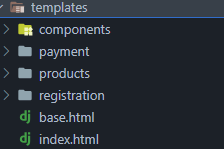
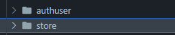

# Arquitetura

## Introdução
A arquitetura é um conceito da engenheria de software que se refere a organização de um sistema, através dela podemos definir quais as funções dos componentes utilizados no mesmo. 

A arquitetura de um software tem como objetivo melhorar o desempenho do software, a escalabilidade do mesmo, compatibilidade e performance. 

No mercado de trabalho, para se escolher uma arquitetura que será utilizada em um software, deve-se analisar as vantagens e desvantagens da mesma e realizar um balanço se de fato temos a necessidade de utiliza-la e se valerá a o trabalho empregado. 

Sendo assim este documento tem como objetivo descrever a arquitetura de software que será utilizada no projeto em questão. 

## Metodologia

Para a escolha da arquitetura do projeto, a equipe produziu os diagramas e com base nos mesmos decidiu um framework que seria mais adequadro para o trabalho e por fim implementou a arquitetura previamente disponível no mesmo. Podemos encontrar as tecnologias escolhidas no documento de [reutilização de software interno](). Com isto, foi feito um estudo da arquitetura disponível e produzido o produto de software.

## Arquitetura MVC

 Na literatura, a arquitetura de n-camadas se caracteriza pela divisão de blocos do sistemas(chamadas layers) de maneira hierarquica, cada layer só pode se comunicar com as debaixo. As layers estão divididas conforme a suas respectivas responsabilidades do sistema. Normalmente, as camadas são divididas fisicamente entre computadores diferentes, todavia, não há de fato a necessidade desta prática. 

 Após a evolução dos modelos de arquitetura de software, surgiu o padrão MVC, no qual é uma arquitetura baseada no padrão de camadas que considera o número de camadas igual a 3. Tal padrão começou a ser utilizado amplamente pela comunidade de software graças aos seus benefícios.

No MVC, temos as seguintes camadas:

- Model: Conhecida como Business Object Model. Gerência e controla a forma como os dados se comportam por meio de funções, lógicas e regras de negócio. Ele vem em anexo com um meio de persistir dados na aplicação
- Controller: Intermedia as requisições enviadas pelo view com respostas fornecidas pela model. Ele repassa os dados entre as camadas. Em alguns casos escolhem as views que serão renderizadas.
- View: Apresenta as informações de maneira visual. A sua lógica deve ser mínima. Se ficar algo muito complexo, vale apena migrar para um modelo viewModel.

O fluxo de trabalho se dá por: View → Controller → Model → Controller → View. Garantindo assim a  segurança, eficiência e otimização do produto. Nesta arquitetura é natural a utilização de design patterns como por exemplo o mediator que está presente na camada controller.

Obs: Alguns autores permitem o dialogo entre View e Model, todavia isso vai contra alguns princípios do princípio N-camadas, caso esta modificação for realmente implementada no sistema, pode-se um programa menos mantenível.

Sendo assim, como toda arquitetura, o MVC possui suas qualidades e suas desvantagens, nos quais podemos citar :

- Benefícios:
  - Curva de aprendizado: Extremamente fácil de se entender.
  - Código mais mantenível.
  - Mais velocidade e otimização nas requisições.
  - Programa fácilmente testável: mais fácil de testar objetos não visuais, como por exemplo a lógica de negócio.

- Desvantagens:
  - Pode ter um acoplamento alto entre view e controller: Devido a grande quantidade de interação, estas duas camadas podem acabar tendo um alto acoplamento.
  - Não é interessante utilizar em programas simples.

## Arquitetura MVC aplicada ao projeto

Como a equipe de desenvolvimento optou por desenvolver o software no framework [Django](https://www.djangoproject.com/) foi aplicado a arquitetura MVC com algumas modificações. Como pontos adjacentes à esta arquitetura podemos citar as 3 camadas e como estão sendo aplicadas:

  - Model: As models estão presentes dentro das pastas relativas ao controlador nos quais elas dialogam.Podemos ver esta relação tanto dentro da pasta [Store](https://github.com/UnBArqDsw2023-2/2023.2_G1_ProjetoAmazon/blob/main/src/store/models.py) quanto da pasta [authUser](https://github.com/UnBArqDsw2023-2/2023.2_G1_ProjetoAmazon/blob/main/src/authuser/models.py)
  
  - Controller: Os controladores estão todos presentes dentro de uma pasta com sua respectiva função, como evidenciado na figura 1. Dentro de cada pasta, podemos encontra as models nos quais os mesmos dialogam. 
  
    

      
      
 Figura 1: Modelo de pastas projeto, controller . Fonte:Autor,2023
 
    

  - View: As views estão todas presentes numa pasta chamada "templates", como visto na figura 2, as mesmas também estão divididas entre funções dentro do programa tais como os controladores.
  
    

      
      
 Figura 2: Modelo de pastas projeto, View . Fonte:Autor,2023
 
    

Podemos chamar o projeto de MVC modificado pois na realidade o framework nos fornece uma arquitetura semelhante, o MTV, que apenas modifica a nomenclatura de cada elemento, sendo M relativo a model, T(template) relativo as views e V(views) relativo a controller. 

## Referências

> [1]   ARDALIS. Visão geral do ASP.NET Core MVC. Disponível em: &#60;https://learn.microsoft.com/pt-br/aspnet/core/mvc/overview?view=aspnetcore-8.0&#38;WT.mc_id=dotnet-35129-website&#62;. Acesso em: 22 nov 2023. 
>
> [2]   LELIS, Renato. Entendendo a arquitetura do Django - Renato Lelis. Medium, 2 Jan 2020. Disponível em: &#60;https://medium.com/@renatojlelis/entendendo-a-arquitetura-do-django-f4b505773c14&#62;. Acesso em: 22 nov 2023.
>
> [3]  EDUCAÇÃO, Redação XP. O que é arquitetura de software? Veja definição e aplicação no mundo corporativo. Disponível em: &#60;https://blog.xpeducacao.com.br/o-que-e-arquitetura-de-software/&#62;. Acesso em: 22 nov 2023. 
>
> [4]  VALENTE, Marco Tulio. Cap. 7: Arquitetura – Engenharia de Software Moderna. Disponível em: &#60;https://engsoftmoderna.info/cap7.html&#62;. Acesso em: 22 nov 2023. 
>
> [5]   FLPN. Qual a diferença entre a arquitetura MVC e a MTV do Django? Disponível em: &#60;https://pt.stackoverflow.com/questions/246881/qual-a-diferen%C3%A7a-entre-a-arquitetura-mvc-e-a-mtv-do-django&#62;. Acesso em: 25 nov 2023. 

‌
## Histórico de versão

| Versão | Data       | Descrição                            | Autor(es)     |  Revisor(es) |
| ------ | ---------- | ------------------------------------ | ------------- | ------------ |
| `1.0`  | 22/11/2023 | Iniciando o documento                |    Kauã       |      Ana     |
| `1.1`  | 22/11/2023 | Adicionando textos padrões           |    Kauã       |      Ana     |
| `1.2`  | 25/11/2023 | Finalizando o documento              |    Kauã       |      Ana     | 
| `1.3`  | 28/11/2023 | Documento revisado              |    Ana       |      Kauã     | 
