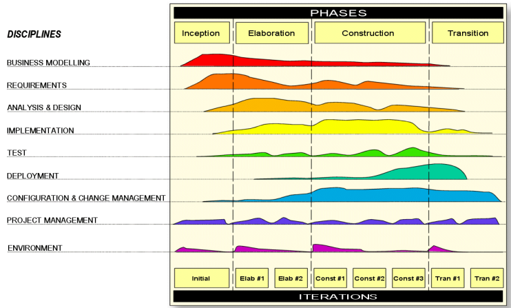
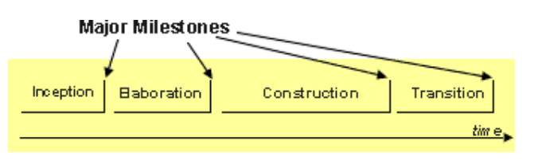

# Síntese do Conteúdo acerca do RUP

## Introdução

O RUP (Processo Unificado da Rational) oferece diretrizes e práticas exemplares para um desenvolvimento de software bem-sucedido, além de uma abordagem disciplinada para a atribuição de tarefas e responsabilidades dentro de uma organização de desenvolvimento. Seu propósito é assegurar a produção de software de alta qualidade que atenda às necessidades dos usuários, seguindo um cronograma e um orçamento previsíveis.

Existem três pontos principais que definem o RUP:

- **Filosofias e Princípios Fundamentais**: 
  As filosofias e princípios são a base sobre a qual o RUP foi desenvolvido. Esses princípios, são explicados mais à frente.

- **Framework de Conteúdo e Blocos de Construção**: 
  A família de plug-ins de método do RUP forma uma estrutura de método que você pode usar para criar suas próprias configurações de método e processos personalizados.

- **Linguagem para Definição de Método e Processo**: 
  Há uma arquitetura de método unificada, fornecendo uma linguagem para descrever métodos e processos. Essa nova linguagem é uma unificação de diferentes métodos e linguagens de engenharia de processo, como a extensão SPEM para a UML para engenharia de processo de software.

## Visão Geral

O RUP é um processo iterativo e incremental, ou seja, o desenvolvimento é feito em ciclos, onde cada ciclo é uma iteração. Cada iteração é uma versão do sistema, que é construída a partir de um conjunto de requisitos. 

Tem-se, no RUP, três perspectivas:

1. Dinâmica: Mostra as fases do RUP através do tempo, nas quais estão em constante mudança e onde está contido o ciclo de vida.
2. Estática: Mostra aspectos estáticos das fases do RUP. Esta perspectiva está voltada para as coisas  que não mudam durante o projeto, todavia trabalham para mudar os processos dinâmicos.
3. Prática: Feito para as boas práticas utilizadas no processo, aqui temos práticas conhecidas pela efetividade e usabilidade através de projetos antigos.

Para esta apresentação será utilizada a perspectiva dinâmica, que é a mais utilizada para explicar o RUP.

### Perspectiva Dinâmica e Ciclo de Vida

O RUP pode ser descrito como um planode duas dimensões, Horizontal e vertical.

- Horizontal: Representa o tempo, ou seja, as fases do RUP e os aspectos dinâmicos do processo, como o ciclo de vida, as iterações e os marcos (milestones).
- Vertical: Representa as disciplinas do RUP e os aspectos estáticos do processo, como as atividades, as tarefas e os artefatos.

### Fases do RUP

O ciclo de vida do RUP é composto por quatro fases, que são:

- **Concepção**: Nesta fase, o objetivo é entender o problema e a solução, além de definir o escopo do projeto. É nesta fase que se define o que será feito, como será feito e quem fará. O resultado desta fase é o documento de visão, que é um documento que contém a descrição do problema, a solução proposta, os requisitos e os riscos do projeto.

- **Elaboração**: Nesta fase, o objetivo é definir uma arquitetura estável para o sistema, além de mitigar os riscos mais críticos. É nesta fase que se define a arquitetura do sistema, os casos de uso e os requisitos não funcionais. O resultado desta fase é o documento de especificação suplementar, que é um documento que contém os requisitos não funcionais, os casos de uso e os requisitos de domínio.

- **Construção**: Nesta fase, o objetivo é construir o sistema, ou seja, implementar os requisitos definidos nas fases anteriores. É nesta fase que se implementa os casos de uso, os requisitos não funcionais e os requisitos de domínio. O resultado desta fase é o sistema executável.

- **Transição**: Nesta fase, o objetivo é entregar o sistema para o cliente, ou seja, colocar o sistema em produção. É nesta fase que se faz a implantação do sistema, a migração de dados e a capacitação dos usuários. O resultado desta fase é o sistema em produção.
  

 
ANWAR, Ashraf. A Review of RUP (Rational Unified Process). Disponível em: [csjournals.org](https://www.cscjournals.org/manuscript/Journals/IJSE/Volume5/Issue2/IJSE-142.pdf)

Ao final de cada fase do RUP tem que gerar um subproduto, definido pelos milestones. Os milestones são pontos de decisão, que são utilizados para avaliar se o projeto está indo bem ou não. Se o projeto estiver indo bem, ele passa para a próxima fase, caso contrário, ele volta para a fase anterior.

- **Concepção**: O subproduto desta fase é o documento de visão, que é um documento que contém a descrição do problema, a solução proposta, os requisitos e os riscos do projeto.

- **Elaboração**: O subproduto desta fase é o documento de especificação suplementar, que é um documento que contém os requisitos não funcionais, os casos de uso e os requisitos de domínio.

- **Construção**: O subproduto desta fase é o sistema executável.

- **Transição**: O subproduto desta fase é o sistema em produção.

 
ANWAR, Ashraf. A Review of RUP (Rational Unified Process). Disponível em: [csjournals.org](https://www.cscjournals.org/manuscript/Journals/IJSE/Volume5/Issue2/IJSE-142.pdf)

### Princípios

Os princípios do RUP são:

- **Adaptar o processo**: o processo deve ser adaptado para atender às necessidades do projeto. Isso é alcançado através da seleção de um subconjunto de elementos do processo e da definição de uma configuração de processo personalizada.
- **Equilibrar prioridades de partes interessadas concorrentes**: o desenvolvimento de software é um processo complexo que envolve muitas partes interessadas. É importante equilibrar as prioridades de todas as partes interessadas para garantir que o projeto seja bem-sucedido.
- **Colaboração entre equipes**: o desenvolvimento de software é um processo colaborativo. A colaboração entre equipes é essencial para o sucesso do projeto. Isso é alcançado através da definição de uma estrutura de equipe, da definição de uma estratégia de comunicação e da definição de uma estratégia de integração.
- **Demonstrar valor de maneira iterativa**: o desenvolvimento de software é um processo iterativo. A iteração é essencial para o sucesso do projeto. Isso é alcançado através da definição de um conjunto de requisitos para cada iteração e da definição de um conjunto de casos de teste para cada iteração.
- **Elevar o nível de abstração**: complexidade é um problema central no desenvolvimento de software. Aumentar o nível de abstração ajuda a reduzir a complexidade e a quantidade de documentação necessária para o projeto. Isso pode ser alcançado através da reutilização, do uso de ferramentas de modelagem de alto nível e da estabilização da arquitetura desde o início.
- **Manter um foco contínuo na qualidade**: a qualidade é um fator importante no desenvolvimento de software. A qualidade é alcançada através da definição de um conjunto de casos de teste para cada iteração e da definição de um conjunto de métricas para cada iteração.

### Boas Práticas

As boas práticas que serão descritas a seguir são utilizadas em larga escala no mercado de trabalho. Para segui-las, o RUP fornece a cada membro da equipe diretrizes, mentores e templates de ferramentas necessários para que a equipe aproveite este ponto. Temos as boas práticas:

- **Desenvolver software iterativamente**: Devido aos softwares de hoje, é muito difícil implementar um modelo cascata, assim o RUP adota medidas que reduzem o risco do projeto, sendo assim, o software deve sempre ter frequentemente versões executáveis e que permitem o feedback dos usuários. Esta medida também traz mais facilidades em mudanças táticas.

- **Gerenciar requisitos**: O RUP descreve como deve ser feito a engenharia de requisitos. Casos de uso e cenários são uma ótima forma excelente de capturar requisitos funcionais e garantir que eles orientem o projeto.

- **Usar arquiteturas baseadas em componentes**:  O processo se concentra em desenvolver uma arquitetura robusta e executável antes de comprometer vários recursos para o desenvolvimento de um projeto em larga escala.

- **Modelar software visualmente**: Devemos modelar o software visualmente para a estrutura e o comportamento da arquitetura. Abstrações visuais nos ajudam a entender diferentes aspectos do programa.
  
- **Verificar a qualidade do software**: A qualidade do software sempre deve ser revista com base nos requisitos elicitados.

- **Controlar mudanças de software**: Deve-se rastrear, controlar e monitorar todas as mudanças. Também é fornecido no modelo como isolar cada desenvolvedor para melhor monitorar suas mudanças, assim, podemos unir todos os contribuintes e trabalhar com qualidade.

## Prós e Contras  

### Prós

- **Resolve roiscos com facilidade**:O RUF ajuda a lidar facilmente com riscos de projetos para garantir que eles estejam alinhados com as necessidades em constante evolução dos consumidores. Além disso, menos recursos são usados no processo de integração, pois a integração é evidente durante toda a fase de desenvolvimento de software.
- **Controlar mudanças**: Com o RUF, sincronizar diferentes componentes do projeto fica mais fácil quando esses componentes são tratados por equipes diferentes. No entanto, é necessário tomar precauções extras para garantir que as mudanças sejam facilmente controladas
- **Padrões flexíveis**: O desenvolvimento de software com RUF se tornou popular porque oferece aos gerentes a oportunidade de reutilizar processos para resolver problemas comuns. Como os projetos nunca são iguais, é fácil modificar processos específicos para atender às necessidades do seu projeto.

- **Processo de entrega eficiente**: O processo também possui um processo de entrega eficiente que permite aos gerentes de projeto planejar e iniciar o projeto. O processo de desenvolvimento fornece aos gerentes os recursos necessários para o projeto inteiro. Além disso, ele utiliza as melhores práticas adotadas em muitos outros projetos em todo o mundo. Em outras palavras, não é necessário criar um projeto do zero quando você pode reutilizar processos.

- **Suporta desenvolvimento iterativo**: O RUP organiza os sistemas em fases para garantir que cada processo tenha iterações executáveis melhores. Os riscos são abordados no início do desenvolvimento e cada iteração permite a verificação de riscos já percebidos bem como a identificação de novos, a arquitetura de software é melhorada através de uma análise repetitiva.

### Contras

- **Complexidade**: O RUP pode ser considerado complexo  e trabalhoso para projetos pequenos, é necessário um bom investimento em ferramentas de suporte.

- **Limitações**: Exige uma boa experiência da equipe, há limitações nas áreas de manutenção, gestão de métricas, gestão pessoal, reutilização e testes.

- **Baixa visibilidade do processo**:  O RUP apresenta dificuldades em fornecer uma visão clara do andamento do projeto, como o cumprimento dos prazos.

- **Desvios da arquitetura principal**: Pode permitir pequenos desvios da arquitetura principal, resultando em sistemas mal estruturados e com problemas de manutenção e escalabilidade ao longo prazo.

- **Caminhos sem saida** : Apresenta problemas de otimização local, onde decisões tomadas em determinada fase do projeto podem não ser adequadas para o projeto como um todo, resultando em caminhos sem saída

## Conclusão
Em síntese, o Rational Unified Process (RUP) é como uma metodologia abrangente e altamente disciplinada para o desenvolvimento de software, fornecendo uma base sólida para garantir a qualidade e eficiência em projetos complexos. Ele oferece uma capacidade de gerenciar riscos, controlar mudanças e, ao mesmo tempo, mantém a flexibilidade para se adaptar às particularidades de cada projeto.
Entretanto, é importante reconhecer que o RUP também apresenta desafios, incluindo sua complexidade, que pode ser excessiva para projetos menores, a falta de visibilidade do processo em algumas situações e a possibilidade de desvios da arquitetura principal.
	No geral, a decisão de adotar o RUP em um projeto deve ser cuidadosamente ponderada, levando em consideração as necessidades específicas do projeto, a experiência da equipe e os recursos disponíveis. É uma abordagem poderosa, mas seu sucesso depende da adaptação inteligente às circunstâncias individuais de cada projeto.

## Referências

1. Péraire, Cécile; Edwards, Mike. The IBM Rational Unified Process for System z. P. 270, 2007.
2. Benefits Of . Benefits of Rational Unified Process. Disponível em:  [benefitsof.net](http://benefitof.net/benefits-of-rational-unified-process/). Acesso em: 29 de agosto de 2023.
3. ANWAR, Ashraf. A Review of RUP (Rational Unified Process). Ashraf Anwar International Journal of Software Engineering (IJSE), n. 5, p. 8, 2014. Disponível em: [cscjournals.org](https://www.cscjournals.org/manuscript/Journals/IJSE/Volume5/Issue2/IJSE-142.pdf). Acesso em 29 de Agosto de 2023.
4. ZEIL, S. J. Software Development Process Models. Disponível em: [cs.odu.edu](https://www.cs.odu.edu/~zeil/cs350/f14/Public/processModels/#disadvantages>). Acesso em: 29 ago. 2023.‌
5. Metodologia RUP. Disponível em: [prezi.com](https://prezi.com/zr9zqoobntcr/metodologia-rup/?fallback=1). Acesso em: 29 ago. 2023.
6. A Rational Software Corporation White Paper. [s.l.: s.n., s.d.]. Disponível em: [cs.ccu.edu.tw](https://www.cs.ccu.edu.tw/~naiwei/cs3021/unifiedProcess.pdf). Acesso em 29 de agosto de 2023‌.

# Histórico de Versão

| Versão | Data       | Descrição                              | Autores                    | Revisores       |
| ------ | ---------- | -------------------------------------- | -------------------------- | --------------- |
| `1.0`  | 29/08/2023 | Elaboração do documento no Google Docs | Ana Beatriz, Beatriz, Kauã | Arthur Ferreira |
| `1.1`  | 13/09/2023 | Transcrição do documento para MarkDown | Augusto Camargo            |                 |