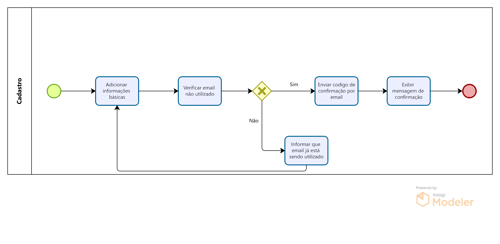
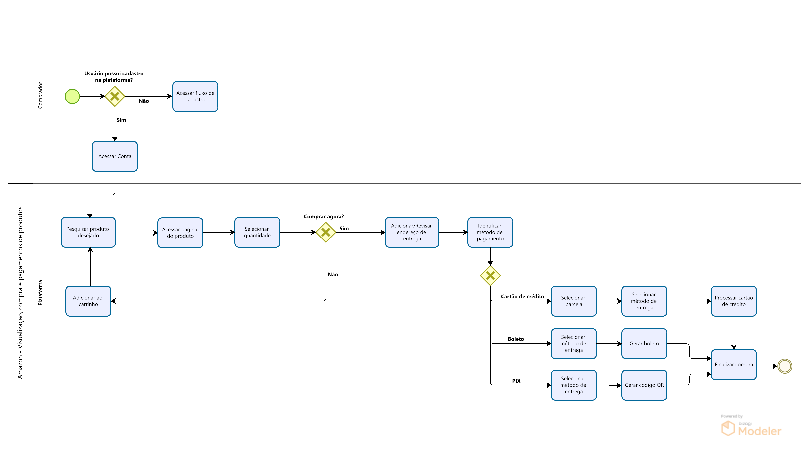

# BPMN

## Introdução & Objetivo

BPMN (Business Process Managemente Notation) é uma notação gráfica que tem por objetivo prover uma gramática de símbolos para mapear, de maneira padrão, todos os processos de negócio de uma organização. [1]

A notação BPMN auxilia no entendimento de processos e de atividades de acordo com o fluxo apresentado.

## Metodologia

## 1. BPMN Metodologia
A imagem 1 mostra o BPMN da parte de Metodologia:

    
 Imagem 1: BPMN Metodologia (Fonte: Autor, 2023).

## 2. BPMN Cadastro
A imagem 2 mostra o BPMN da parte de cadastro da aplicação:

    
 Imagem 2: BPMN Cadastro (Fonte: Autor, 2023).

## 3. BPMN visualização de produtos, compra e pagamento
A imagem 3 mostra o BPMN da parte de interação com o produto:

    
 Imagem 3: BPMN visualização de produtos, compra e pagamento (Fonte: Autor, 2023).

## Referências Bibliográficas

> [1] SGANdDERLA, Kelly. Um guia para iniciar estudos em BPMN (I): Atividades e sequência, 19 de novembro de 2012; http://blog.iprocess.com.br/2012/11/um-guia-para-iniciar-estudos-em-bpmn-i-atividades-e-sequencia/

## Histórico de Versão

| Versão | Data       | Descrição                               | Autor(es)   | Revisor(es) |
| ------ | ---------- | --------------------------------------- | ----------- | ----------- |
| `1.0`  | 14/09/2023 | Adição da introdução e BPMN de cadastro |   Samuel    |    Bruno    |
| `1.1`  | 14/09/2023 | Padronização do documento               |   Kauã      |   Samuel    |
