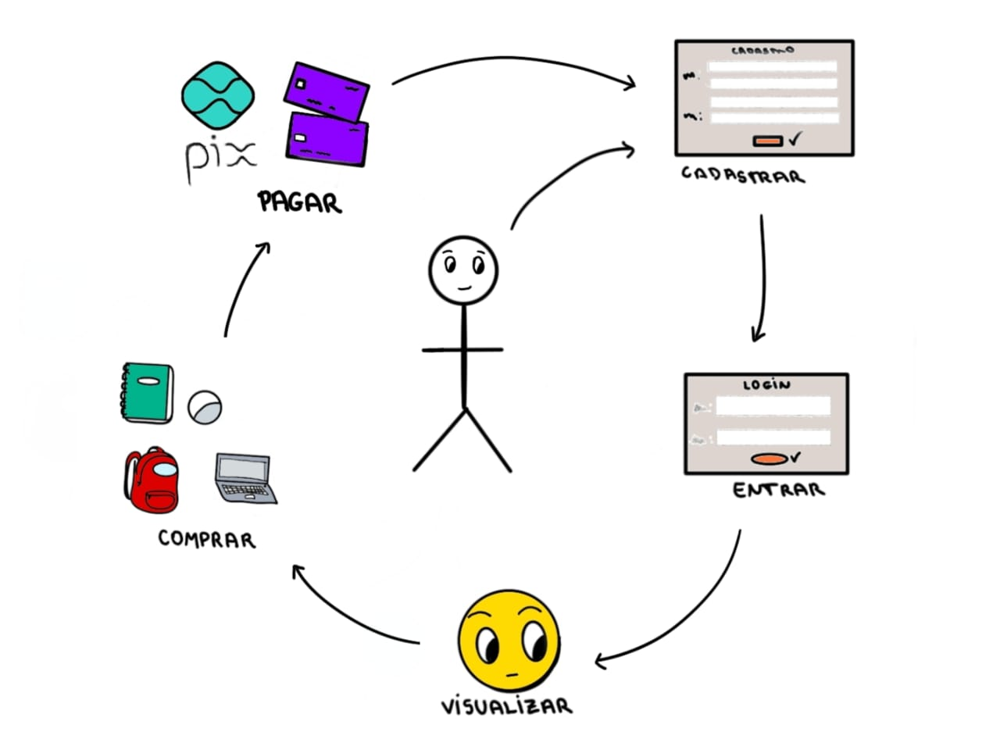
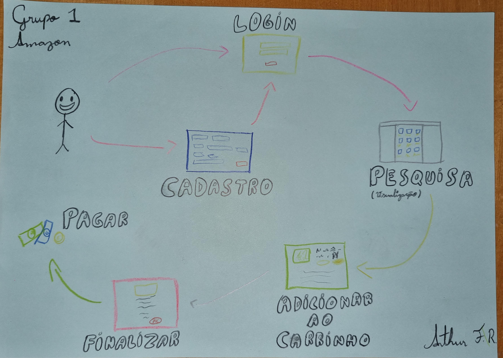
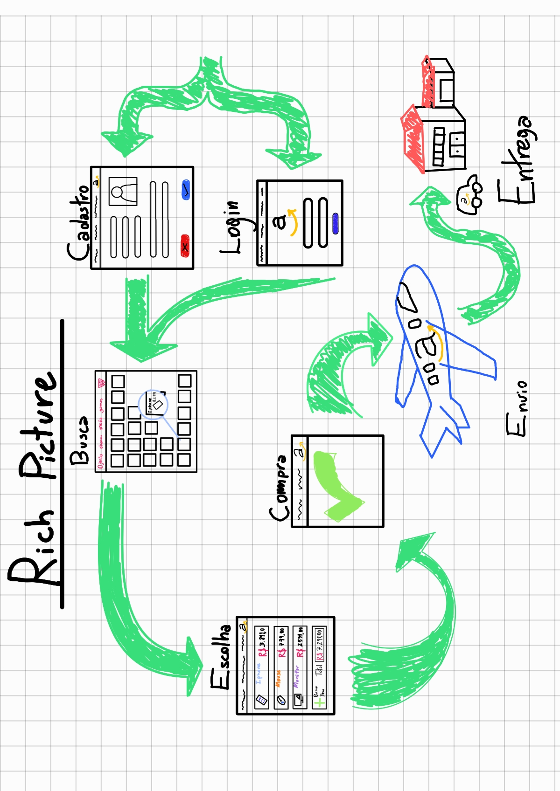
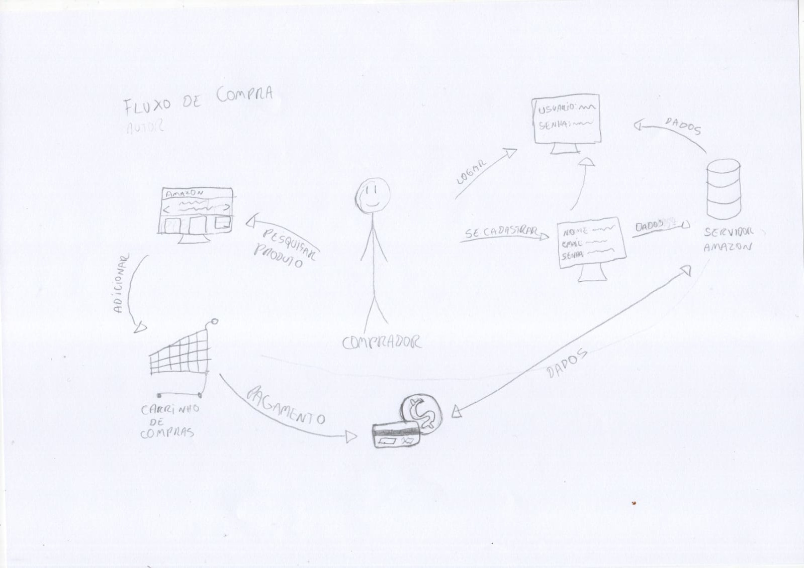
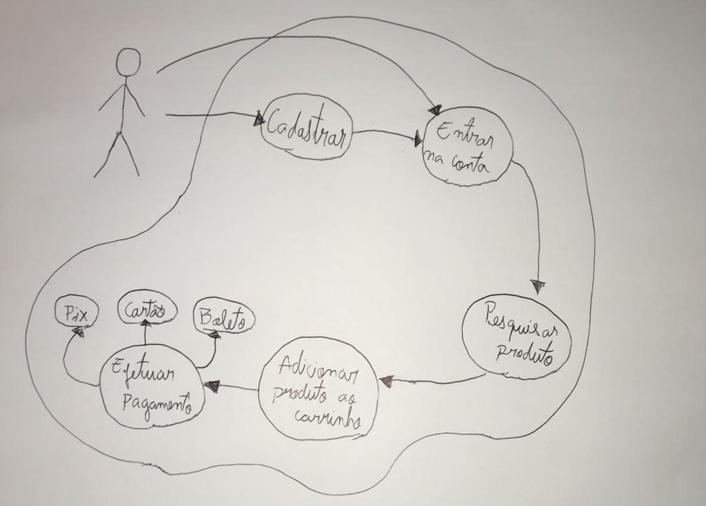
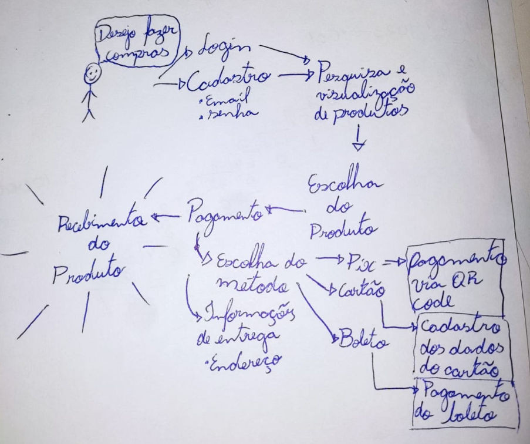
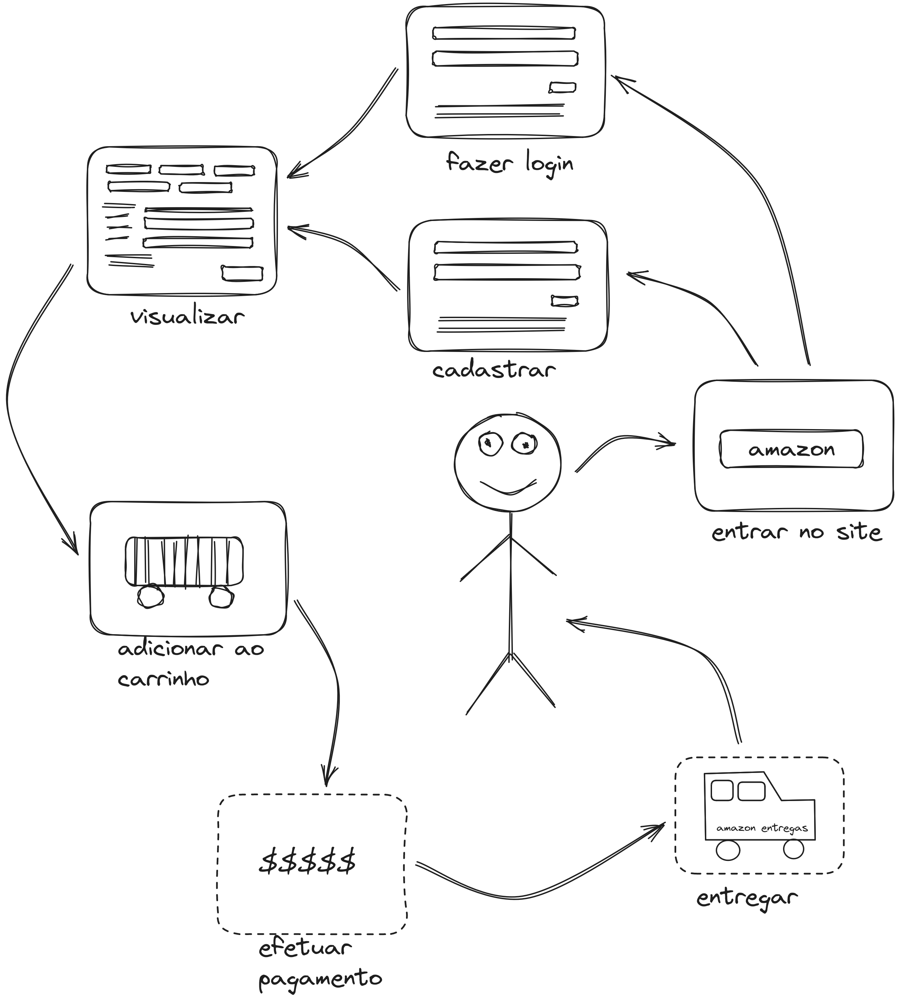
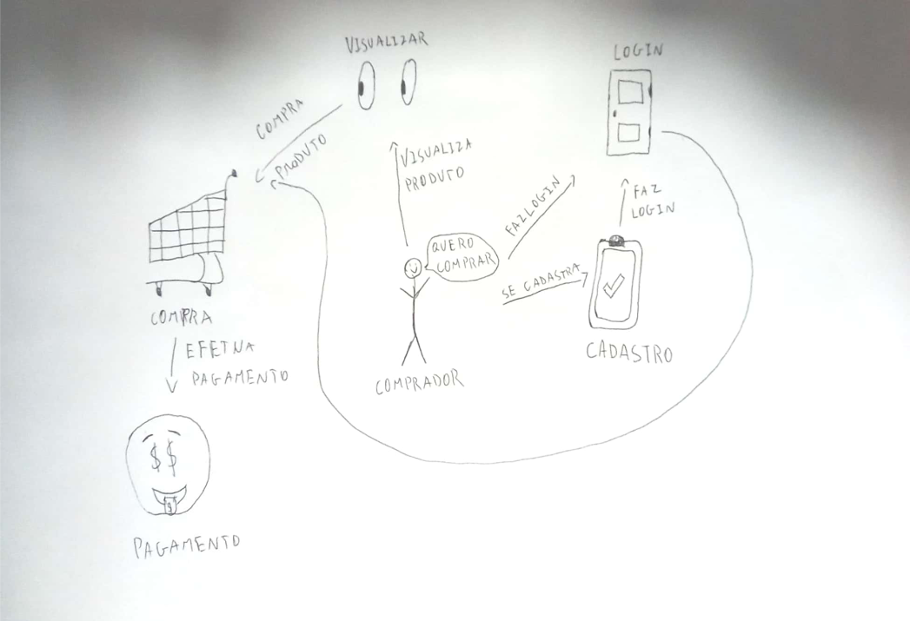
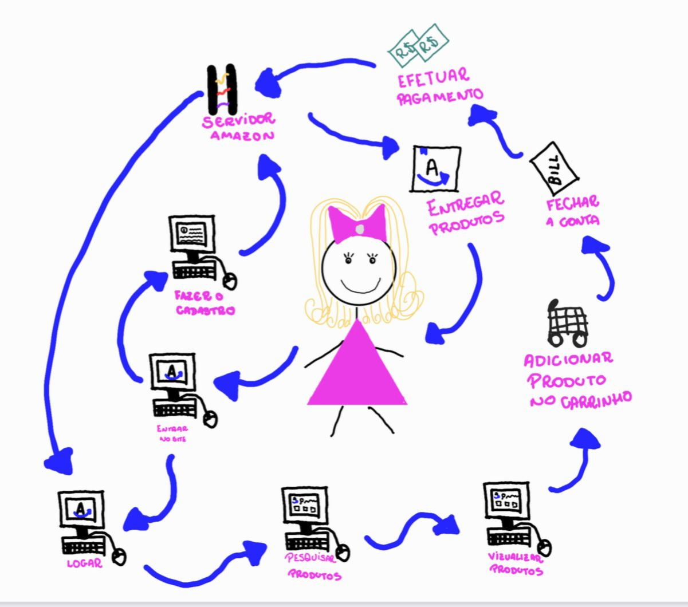

# Rich Picture

## Introdução

O Rich Picture é uma ferramenta visual para expressar ideias e analisar
problemas. Os artefatos elaborados são construídos de maneira informal, visando
o fácil entendimento.

No contexto da Engenharia de Software, essa ferramenta é utilizada para
diagramar o(s) fluxos(s) de um sistema de software, usando elementos como
setas, atores e processos.

## Artefatos

### Ana Beatriz

<figure>
  
  <figcaption>Figura 1: Rich Picture (2023, Ana Beatriz)</figcaption>
</figure>

### Arthur Ferreira

<figure>
  
  <figcaption>Figura 2: Rich Picture (2023, Arthur Rodrigues)</figcaption>
</figure>

### Augusto Camargo

<figure>
  
  <figcaption>Figura 3: Rich Picture (2023, Augusto Camargo)</figcaption>
</figure>

### Beatriz Vieira

<figure>
  
  <figcaption>Figura 4: Rich Picture (2023, Beatriz Vieira)</figcaption>I
</figure>

### Bruno Oliveira

<figure>
  
  <figcaption>Figura 5: Rich Picture (2023, Bruno)</figcaption>
</figure>

### Gabriel Luiz

<figure>
  
  <figcaption>Figura 6: Rich Picture (2023, Gabriel Luiz)</figcaption>
</figure>

### Guilherme Puida

<figure>
  
  <figcaption>Figura 7: Rich Picture (2023, Guilherme Puida)</figcaption>
</figure>

### Kauã Vinícius

<figure>
  
  <figcaption>Figura 8: Rich Picture (2023, Kauã Vinícius)</figcaption>
</figure>

### Mylena Angélica

<figure>
  
  <figcaption>Figura 9: Rich Picture (2023, Mylena)</figcaption>
</figure>

### Samuel Sato

<figure>
  
  <figcaption>Figura 10: Rich Picture (2023, Samuel)</figcaption>
</figure>

## Histórico de versão

| Versão | Data       | Descrição                                     | Autor(es) | Revisor(es) |
| ------ | ---------- | --------------------------------------------- | --------- | ----------- |
| `1.0`  | 14/09/2023 | Iniciando o documento                         | Guilherme | Kauã        |
| `1.1`  | 14/09/2023 | Revisando documento e adicionando um RP       | Kauã      | Arthur      |
| `1.2`  | 14/09/2023 | Conserta path das imagens e adicionando um RP | Arthur    | Arthur      |
