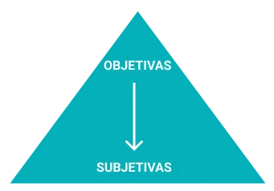

# Entrevista

## Introdução

Neste artefato, está descrita a tecnica de elicitação: "Entrevista". Tal tecnica é a mais conhecida e envolve discussões individuais com os stakeholders, ela é muito poderosa por ser um método verbal fácil e efetivo de se obter informações. Como Entrevistador, deve-se sempre estar aberto à novas ideias além de estimular o entrevistado a participar de um diálogo com questões que atingem um ponto desejado em comum.
Para a realização da entrevista, foi passado para os entrevistados um [termo de consentimento](https://docs.google.com/document/d/1UvqmlaHauq9a1J6Ixsz-MRxIhAP51uipcxEwMAeUxjA/edit?usp=sharing) no qual afirma que os mesmos autorizam a utilização de sua voz e vídeo para a realização do processo.

## Metodologia

Para a realização da entrevista, foi utilizado um modelo pirâmide no qual inicia-se com perguntas mais objetivas e com o decorrer do evento, mais perguntas subjetivas são realizadas, naturalmente é um modelo que é mais util quando o entrevistado se sente relutânte em relação a determinadas situações. A estrutura é descrita visualmente na imagem abaixo:

    
    
 Figura 1: Modelo pirâmidal de entrevista . Fonte: <a href="https://victorstati.medium.com/t%C3%A9cnicas-para-levantamento-de-requisitos-4907975498ac">Medium</a>
 

Na parte das perguntas objetivas, foi utilizado a tecnica 5W2H para encontrar metodologicamente os questionamentos que seriam feitos. Já as perguntas subjetivas foram realizadas de acordo com as respostas do entrevistado.

## Perguntas realizadas

Para as perguntas objetivas, utilizou o 5W2H que é uma técnica de gerenciamento de projetos que ajuda a garantir que todos os aspectos relevantes de uma tarefa ou projeto sejam considerados e planejados de maneira adequada. A técnica 5W2H² consiste basicamente em responder 7 perguntas simples para identificar e planejar os principais aspectos de uma tarefa ou projeto. São elas apresentadas na tabela 1:

| Acrônimo | Pergunta |
| -------- | -------- |
| What     | O quê    |
| Why      | Por quê  |
| Who      | Quem     |
| When     | Quando   |
| Where    | Onde     |
| How      | Como     |
| How much | Quanto   |

 Tabela 1: Acrônimos da técnica 5W2H (Fonte: [Ana Beatriz](https://github.com/ananorberto)  , 2023).

Com base nisto, a tabela 2 apresenta as perguntas escolhidas para as entrevistas:

| Acrônimo | Pergunta                                                                                                                                                   |
| -------- | ---------------------------------------------------------------------------------------------------------------------------------------------------------- |
| What     | O quê você acha que pode melhorar na tela de comprador da Amazon?                                                                                          |
| Why      | Porque você tem/teria a preferência pela Amazon em relação a outras plataformas de e-commerce?                                                             |
| Who      | Além de você, quem da sua família também faz compras pela Amazon?                                                                                          |
| When     | Quando você se sente motivado a fazer compras através de uma empresa de e-commerce?                                                                        |
| Where    | Por onde você normalmente faz compras na Amazon? Celular, computador ou outro?                                                                             |
| How      | Como você acha que seria o desenho de um fluxo “ideal” para um aplicativo de e-commerce? Inicie a partir da main page do site, até o pagamento do produto. |
| How much | Quanto tempo você acha que é o ideal para você realizar todo o processo de visualização, compra e pagamento dos produtos que você deseja?                  |

 Tabela 2: Perguntas objetivas(Fonte: Autor, 2023).

## Dados demográficos dos entrevistados

Para uma entrevista, é necessário entender o perfil dos entrevistados. A tabela 3 apresenta os dados demográficos dos indivíduos questionados.

| Nome | Idade | Gênero | Escolaridade | Ocupação | Estado civil |
| ---- | ----- | ------ | ------------ | -------- | ------------ |
|      |       |        |              |          |              |
|      |       |        |              |          |              |

 Tabela 3: Dados demográficos dos entrevistados (Fonte: Autor, 2023).

## Entrevistas

## Requisitos elicitados

Com base nas entrevistas realizadas, foi possível elicitar os seguintes requisitos que estão presentes na tabela 5, que é auxiliado pela tabela 4 que descreve as legendas:

| Abreviação | Significado             |
| ---------- | ----------------------- |
| ENT        | Entrevista              |
| RF         | Requisito Funcional     |
| RNF        | Requisito Não Funcional |

 Tabela 4:Legendas(Fonte: Autor, 2023).

| Legenda | Descrição  |
| ------- | ---------- |
| ENT01   | Entrevista |

 Tabela 5 : Requisitos elicitados(Fonte: Autor, 2023).

## Referências

> [1] https://pt.semrush.com/blog/metodo-5w2h   > [2] https://victorstati.medium.com/t%C3%A9cnicas-para-levantamento-de-requisitos-4907975498ac   > [3] https://github.com/Requisitos-de-Software/2023.1-Simplenote/blob/main/docs/elicitacao/entrevista.md   > [4] https://retraining.inf.ufsc.br/guia/app/classificacoes/tecnicas-de-elicitacao-de-requisitos/entidades/tecnicas-de-elicitacao-de-requisitos-entrevista 

## Histórico de versão

| Versão | Data       | Descrição             | Autor(es) | Revisor(es) |
| ------ | ---------- | --------------------- | --------- | ----------- |
| `1.0`  | 02/09/2023 | Iniciando o documento | Kauã      | Mylena      |
