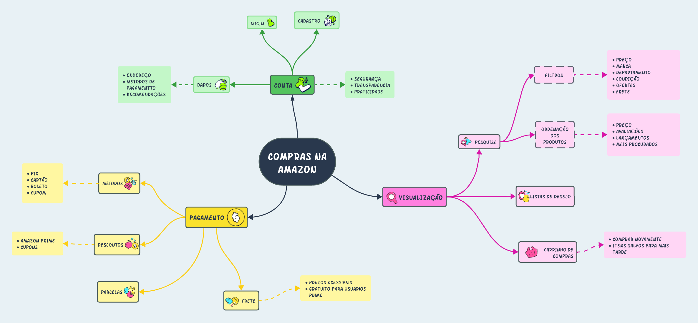

# Mapa Mental

## Introdução

Um mapa mental é uma representação visual que condensa conceitos e pensamentos de maneira gráfica, estabelecendo vínculos entre palavras e imagens que irradiam de um ponto central. Essas representações gráficas são especialmente valiosas para aprimorar a memorização, especialmente quando são criadas manualmente. [¹](#ancora)

## Metodologia

Para a realização do Mapa Mental foram utilizadas algumas regras simples: [¹](#ancora)

1. Começamos escrevendo com a folha na horizontal, pois tínhamos um melhor campo de visão.
2. Escrevemos o título no centro e circulamos.
3. No centro, iniciaram os conceitos mais gerais e os mais específicos nos extremos.
4. Preferimos escrever no sentido horário.
5. Procuramos não usar linhas retas, fizemos linhas curvas. Linhas curvas estimularam mais o cérebro.
6. Variamos muito as cores, deixando o vermelho para lembrar informações negativas.
7. Não fizemos mapas muito grandes ou confusos. Quando tivemos muita informação, escolhemos alguns ramos para fazer novos mapas mentais.
8. Tentamos inserir desenhos ou símbolos coloridos que facilitaram a memorização.
9. Utilizamos letras grandes. 
11. Escrevemos o mínimo possível, dando preferência às palavras-chave que nos ajudaram a lembrar dos conceitos estudados.
12. Fizemos com que nossos desenhos fossem relacionados a palavras, mesmo que isso parecesse absurdo. 

Primeiro fizemos o esboço do mapa mental no papel e após isso passamos para uma versão digital utilizando o aplicativo COLOCAR O NOME DO APLICATIVO.

## Mapa Mental - Versão Manual
INSERIR IMAGEM DPS

 Imagem 1: Mapa Mental Versão Manual (Fonte: Autor, 2023).

## Mapa Mental - Versão Digital

  

    
    
 Imagem 2: Mapa Mental Versão Digital (Fonte: Autor, 2023).</a>
 

## Requisitos elicitados

Com base no Mapa Mental, foi possível elicitar os seguintes requisitos que estão presentes na tabela 1

| Legenda | Descrição                                                                                      | Tipo |
| ------- | ---------------------------------------------------------------------------------------------- | ---- |
| ENT01   |                                                                                                | RF   |

 Tabela 1:Requisitos Elicitados (Fonte: Autor, 2023).

### Legenda
| Abreviação | Significado             |
| ---------- | ----------------------- |
| MP         | Mapa Mental             |
| RF         | Requisito Funcional     |
| RNF        | Requisito Não Funcional |

 Tabela 2:Legendas (Fonte: Autor, 2023).

## Referências

> [1] Você sabe criar um mapa mental efetivo?. Disponivel em: [proximosconcursos](https://www.proximosconcursos.com/mapa-mental-efetivo/). Acesso em 5 de setembro de 2023.
> 

## Histórico de versão

| Versão | Data       | Descrição             | Autor(es) | Revisor(es) |
| ------ | ---------- | --------------------- | --------- | ----------- |
| `1.0`  | 05/09/2023 | Iniciando o documento | Beatriz   | Ana      |
| `1.1`  | 06/09/2023 | Ajuste em modelo do documento | Beatriz   | Ana      |
