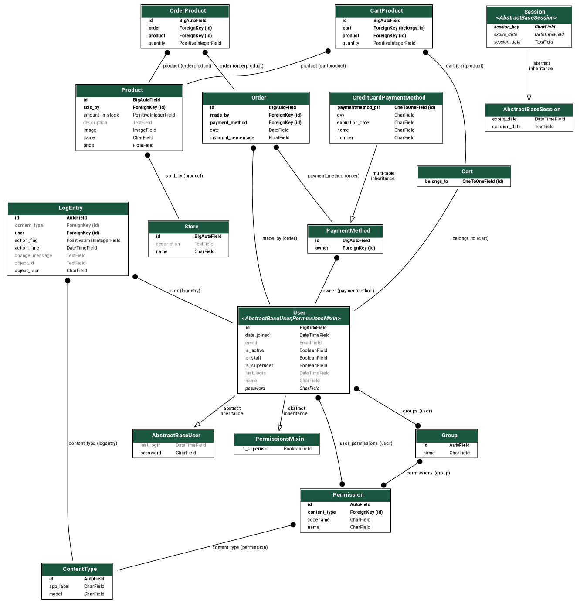

# Visão de dados

A arquitetura de dados do projeto baseia-se no modelo MVC (Model-View-Controller) oferecido pelo Django. As principais entidades do sistema são mapeadas para modelos Django, que, por sua vez, são traduzidos em tabelas no banco de dados SQLite. 

## **Motivação uso do SQLite:**

**Amigável ao usuário:** O SQLite é às vezes descrito como um banco de dados "zero configuração" pronto para uso imediato. O SQLite não é executado como um processo de servidor, o que significa que nunca precisa ser parado, iniciado ou reiniciado, e não possui arquivos de configuração que precisam ser gerenciados. Esses recursos ajudam a simplificar o caminho desde a instalação do SQLite até a integração com um aplicativo.

**Portátil:** Ao contrário de outros sistemas de gerenciamento de banco de dados, que normalmente armazenam dados como um grande lote de arquivos separados, um banco de dados SQLite inteiro é armazenado em um único arquivo. Esse arquivo pode ser localizado em qualquer lugar em uma hierarquia de diretórios e pode ser compartilhado via mídia removível ou protocolo de transferência de arquivos.

## **Considerações de Desempenho e Segurança**

**Desempenho:** O SQLite é escolhido por sua simplicidade e eficiência para projetos de médio porte. Entretanto, é importante monitorar o desempenho à medida que a base de dados cresce e considerar a migração para um sistema de gerenciamento de banco de dados mais robusto se necessário.

**Segurança:** O Django oferece recursos de segurança incorporados, como proteção contra SQL injection e autenticação de usuários. Certifique-se de seguir boas práticas de segurança, como validação de entrada e controle de acesso.

## **Diagrama entidade relacionamento (DER)**

    
    
 Diagrama entidade relacionamento(DER) (Fonte: Autor)

| Versão |    Data    |                Descrição                 |     Autor     |    Revisor    |
| :----: | :--------: | :--------------------------------------: | :-----------: | :-----------: |
| `1.1`  | 30/11/2023 |Criação do documento inicial|  Augusto D. Camargo  |    Arthur F. Rodrigues   |
| `1.2`  | 30/11/2023 |Adição de imagens e finalização do documento|  Augusto D. Camargo  |    Arthur F. Rodrigues   |