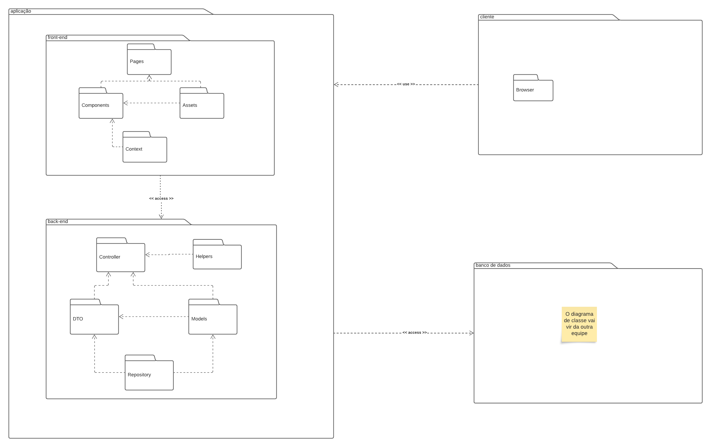
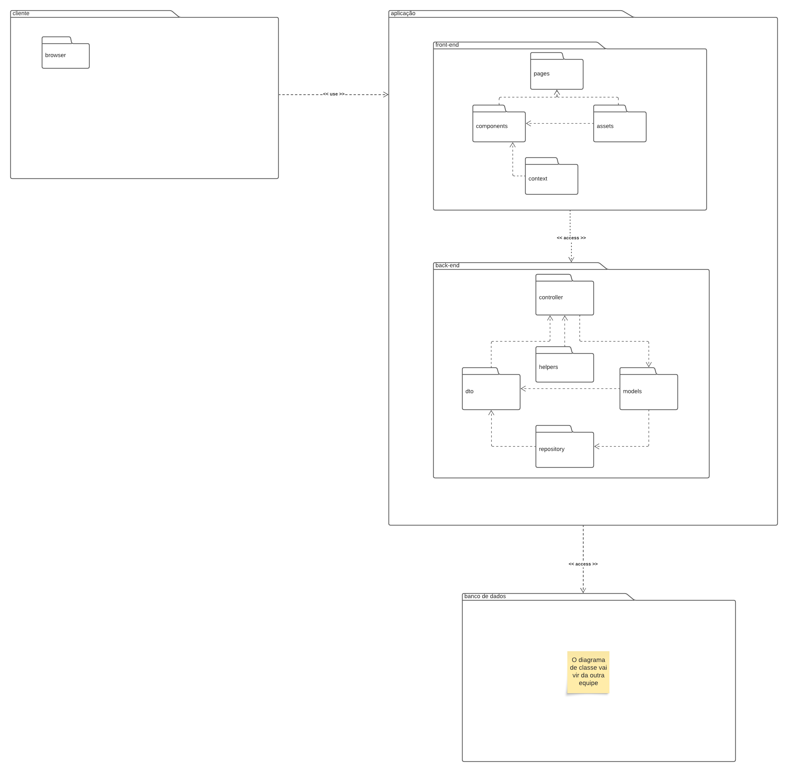

# Diagrama de Pacotes

## Introdução

Temos diversos tipos de diagramas estruturais UML, sendo assim, este artefato tem como objetivo abordar a diagramação UML de _pacotes_ afim de promover uma melhor organização para o código do projeto.

### Diagrama de pacotes

É um diagrama estrutural e estático que tem como objeto mostrar a disposição de pacotes (conjunto de elementos) dentro do projeto. O objeto de estudo se torna as pastas do projeto e a hierarquia entre elas.Além disto, podemos listar como benefícios:

- Simplificam diagramas de classe complexos.
- Fornecem visibilidade geral de sistemas de grande escala.
- São de fácil mudança e flexivel à evolução.

Como componentes básicos podemos citar os pacotes, as dependências e as notações de elemento (Mesclagem, importação de pacote e de elemento). Podemos utiliza-los em conjunto com outros diagramas. Uma descrição maior do diagrama de pacotes será feita nas seções seguintes.

### Notações

É importante ressaltar algumas relações de dependência dentre os pacotes, por exemplo:

- << Access >> : Indica que um pacote requer assistência das funções de outro pacote.
- << Import >> : O pacote de onde a seta parte importa alguma característica do outro pacote.
- << Merge >> : O pacote e sua dependência são unidos em um só.
- << Use >> : Ocorre quando um determinado elemento nomeado requer outro para sua definição e implementação completa. Exemplo: cliente e fornecedor.

## Metodologia

Para a confecção do diagrama de pacotes, os membros responsáveis decidiram escolher os pacotes mais "primordiais" da maioria das stacks. Com isso, os responsáveis se reuniram no discord no dia 28/09/2023 às 19 horas para fazer o diagrama no qual está prototipado no aplicativo [Lucidchart](https://lucid.app/lucidchart/c7aff09a-0b81-479f-8555-5c3e10507aa4/edit?viewport_loc=-11%2C-11%2C1480%2C641%2C0_0&invitationId=inv_8f25f8f6-e5ef-4a74-a75a-2f49625b6949). Por fim, foi publicado o diagrama para os membros do grupo ficarem cientes do processo.

## Diagramas

As imagens 1 até 4 revelam os diagramas desenvolvidos durante a confecção deste artefato:

### Primero diagrama

Para o primeiro diagrama descrito na imagem 1, nós buscamos representar a aplicação de uma maneira mais simples e rústica, já que o diagrama de classe ainda estava sendo produzido. Nele, temos um nível máximo de granulação de 3. Segue o diagrama:

    
    
 Imagem 1: Diagrama de pacotes, primeira versão (Fonte: Autor, 2023).
 

### Segundo diagrama

Para o segundo diagrama descrito na imagem 2, buscamos corrigir alguns erros ponderados pela profesora em relação ao ultimo diagrama. Mantemos o nível de granulação 3 e apenas mudamos alguns elementos de posição. Segue o diagrama:

    
    
 Imagem 2: Diagrama de pacotes, segunda versão (Fonte: Autor, 2023).
 

### Terceiro diagrama

Para o terceiro diagrama descrito na imagem 3, buscamos refinar ainda mais o diagrama. Aumentamos o nível de granulação para 4, adicionamos novos pacotes e adicionamos os relacionamentos. Segue o diagrama:

    
    
 Imagem 3: Diagrama de pacotes, terceira versão (Fonte: Autor, 2023).
 

### Diagrama final

Por fim, a imagem 4 revela o diagrama de pacotes final. Nele, podemos observar um maior rebuscamento em cada pacote e contendo um nível de granulação de 4, também, houve a modificação no pacote "Banco de dados" já que o mesmo ficaria ambiguo ao [diagrama de classes](https://github.com/UnBArqDsw2023-2/2023.2_G1_ProjetoAmazon/tree/main/docs/Modelagem/DiagramaDeClasses). Segue o diagrama:

    
<iframe allowfullscreen frameborder="0" style="width:820px; height:720px" src="https://lucid.app/documents/embedded/f0a2748a-4b6a-4d24-b1f1-d8f17136f0d4" id="zqeCK44ATghX"></iframe>

    
 Imagem 4: Diagrama de pacotes, versão final (Fonte: Autor, 2023).
 

## Pacotes do diagrama

O diagrama foi estruturado com os seguintes componentes:

### Frontend

Este pacote está diretamente relacionado à UI/UX do produto. Nele, temos subpacotes relacionados ao design do produto e sua relação com um outro serviço. Seguem os subpacotes:

- Assets : Pacote onde armazenará todas as imagens do frontend.
- Components : Pacote responsável por armazenar micro-estruturas que serão combinadas no subpacote de pages. No nosso contexto, podemos citar um componente de produto, no qual será uma pequena capsula na qual armazenará todos os dados de um produto que será exibido para o usuário.
- Context : Pacote responsável por realizar as requisições HTTP com serviços externos à aplicação, como de exemplo, o backend. Além disso, ela armazena dados globais que serão utilizados no pacote. A aplicação utilizará uma API própria.
- Pages : Pacote responsável por armazernar as páginas que realização a interação com o usuário. No contexto da aplicação, podemos citar: página de login, página de cadastro, página de produtos, etc.

### Backend

Este pacote está relacionado ao intermédio entre o pacote de Banco de dados e o de frontend, nesse pacote podemos realizar a tratativa dos dados com base nas regras de negócio. Seguem os subpacotes:

- Controller : Subpacote responsável por receber e enviar as requisições. Nele nós faremos a tratativa dos dados necessários. No caso da nossa aplicação, os controllers atuarão em diversas frentes. A primeira é a de pagamento, na qual ela irá gerar as informações necessárias conforme o método de pagamento e receberá a informação quando o pagamento for efetuado. A segunda frente está relacionado ao processo de cadastro e login, na qual o controller recebe as informações do usuário e cria uma nova conta ou loga em uma já existente. A terceira se relaciona com o produto em si, no qual o controller solicita ao banco de dados os produtos com as devidas informações desejadas pelo cliente.
- DTO : Subpacote responsável por armazenas as [DTOs](https://pt.stackoverflow.com/questions/31362/o-que-%C3%A9-um-dto), as DTOs são responsáveis por agrupar dados ou mapear informações obtidas do banco de dados trabalhando em paralelo as models. Sendo assim, para a nossa aplicação, é importante uma DTO na qual permita a pesquisa do carrinho de um usuário sem que o frontend receba uma requisição contendo email e senha do mesmo,sendo assim, as DTOs também são úteis para a segurança do usuário.
- Helpers : Subpacote resposável por conter arquivos com funções de auxilio. No contexto da aplicação, teriamos funções nas quais podem realizar a validação da senha do usuário.
- Middleware: Subpacote de controller no qual realiza a verificação de dados, como de exemplo, se ele receber uma requisição vazia, ele pode abortar a operação com um erro.
- Models : Subpacote resposável por armazenar grande parte dos objetos que utilizaremos na aplicação, no geral, elas seguirão um mesmo padrão do que está descrito no [diagrama de classes](https://github.com/UnBArqDsw2023-2/2023.2_G1_ProjetoAmazon/tree/main/docs/Modelagem/DiagramaDeClasses) sendo assim, teremos models como: Pix, Conta, Pedido, Produto, etc.
- Operator : Subpacote de controller responsável por fazer a ligação direta com o frontend.
- Repository : Subpacote responsável por realizar as requisições para o banco de dados, ele separa o banco de dados do resto da aplicação.
- Service : Subpacote responsável por tratar erros de dados providos do banco de dados. Por exemplo, se alguma informação estranha do banco de dados, ele aborta a operação com um erro.

### Banco de dados

O pacote de banco de dados se refere diretamente ao [diagrama de classes](https://github.com/UnBArqDsw2023-2/2023.2_G1_ProjetoAmazon/tree/main/docs/Modelagem/DiagramaDeClasses) já produzido outrora no projeto. Ele evidencia as classes: PIX, Boleto, Cartão, Pagamento, Pedido,Produto,Conta e Endereço.

## Bibliografia

> [1] O que é um diagrama UML? Lucidchart. Disponível em: <https://www.lucidchart.com/pages/pt/o-que-e-uml>. Acesso em: 28 set. 2023.
>
> [2] O que é diagrama UML e como fazer? Veja tipos, modelos e exemplos. https://miro.com/. Disponível em: <https://miro.com/pt/diagrama/o-que-e-uml/>. Acesso em: 28 set. 2023.
>
> [3] Tutorial sobre diagramas de pacotes UML. Lucidchart. Disponível em: <https://www.lucidchart.com/pages/pt/diagrama-de-pacotes-uml>. Acesso em: 28 set. 2023.
>
> [4] Context – React. Reactjs.org. Disponível em: <https://legacy.reactjs.org/docs/context.html>. Acesso em: 28 set. 2023.
>
> [5] QUE, O. O que é um DTO? Stack Overflow em Português. Disponível em: <https://pt.stackoverflow.com/questions/31362/o-que-%C3%A9-um-dto>. Acesso em: 28 set. 2023.
>
> [6] .NET - Apresentando o padrão Repository. Macoratti.net. Disponível em: <https://www.macoratti.net/11/10/net_pr1.htm#:~:text=O%20que%20%C3%A9%20o%20padr%C3%A3o,camada%20de%20neg%C3%B3cios%20(BLL).>. Acesso em: 28 set. 2023.
>
> [7] Tutorial sobre diagramas de pacotes UML. Lucidchart. Disponível em: <https://www.lucidchart.com/pages/pt/diagrama-de-pacotes-uml>. Acesso em: 30 set. 2023.

‌

## Histórico de versão

| Versão |    Data    |                Descrição                 |     Autor     |    Revisor    |
| :----: | :--------: | :--------------------------------------: | :-----------: | :-----------: |
| `1.1`  | 28/09/2023 |           Criação do documento           | Kauã e Mylena | Ana e Beatriz |
| `1.2`  | 28/09/2023 | Adição das imagens e de mais informações | Kauã e Mylena | Ana e Beatriz |
| `1.3`  | 08/10/2023 |         Finalização do documento         |     Kauã      | Ana e Beatriz |
| `1.4`  | 09/10/2023 |      Revisão antes da apresentação       |    Arthur     |    Arthur     |
