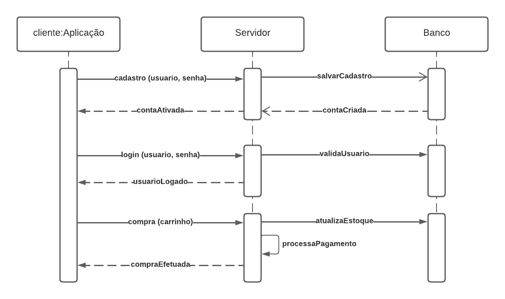

# Diagrama de Sequência

## Introdução

O diagrama de sequência é um diagrama de interação que mostra como os processos operam com um foco em sequência. Ele mostra objetos, classes e componentes envolvidos nas operações e a sequência de mensagens trocadas entre os objetos necessários para realizar a funcionalidade da operação. [1]

## Metodologia

Para a criação do diagrama de sequência, foi utilizado o site [LucidChart](https://www.lucidchart.com/), que é uma ferramenta online para criação de diagramas.

## Diagrama

## Referências

> [1] O que é um diagrama de sequência UML?. Disponivel em: [https://www.lucidchart.com/pages/pt/o-que-e-diagrama-de-sequencia-uml](https://www.lucidchart.com/pages/pt/o-que-e-diagrama-de-sequencia-uml). Acesso em 4 de out. de 2023.

> [2] Tutorial do Diagrama de Sequência: Guia completo com exemplos. Disponivel em: [https://creately.com/blog/pt/diagrama/tutorial-do-diagrama-de-sequencia/](https://creately.com/blog/pt/diagrama/tutorial-do-diagrama-de-sequencia/). Acesso em 4 de out. de 2023.

## Histórico de versão

| Versão | Data       | Descrição                           | Autor(es) | Revisor(es) |
| ------ | ---------- | ----------------------------------- | --------- | ----------- |
| `1.0`  | 04/10/2023 | Adicionando Diagrama e Documento MD | Augusto   | Arthur      |
| `1.1`  | 08/10/2023 | Finalizando Documento MarkDown      | Arthur    | Guilherme   |
