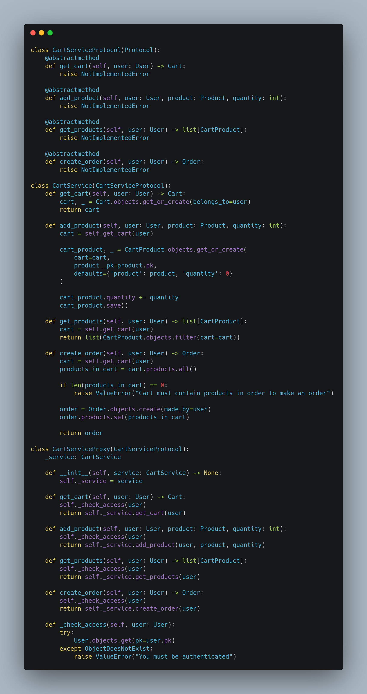
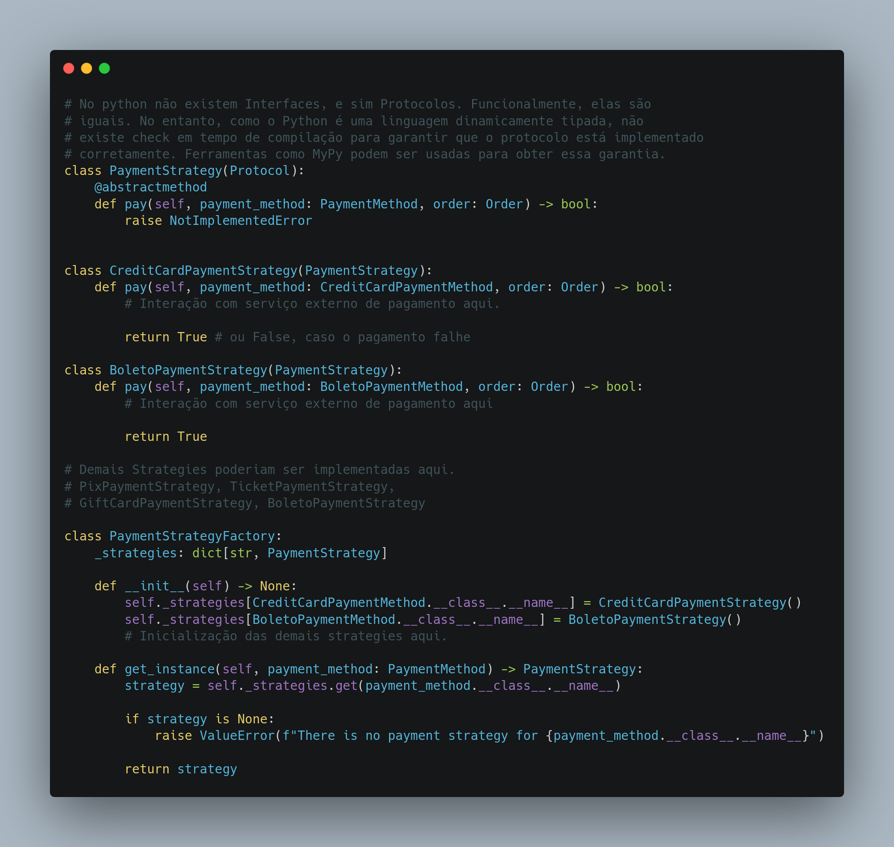
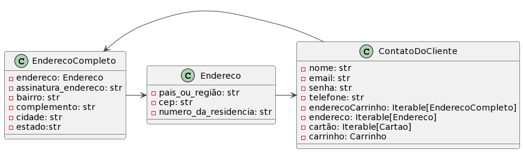
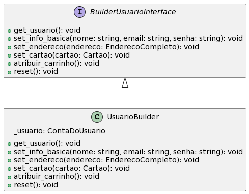
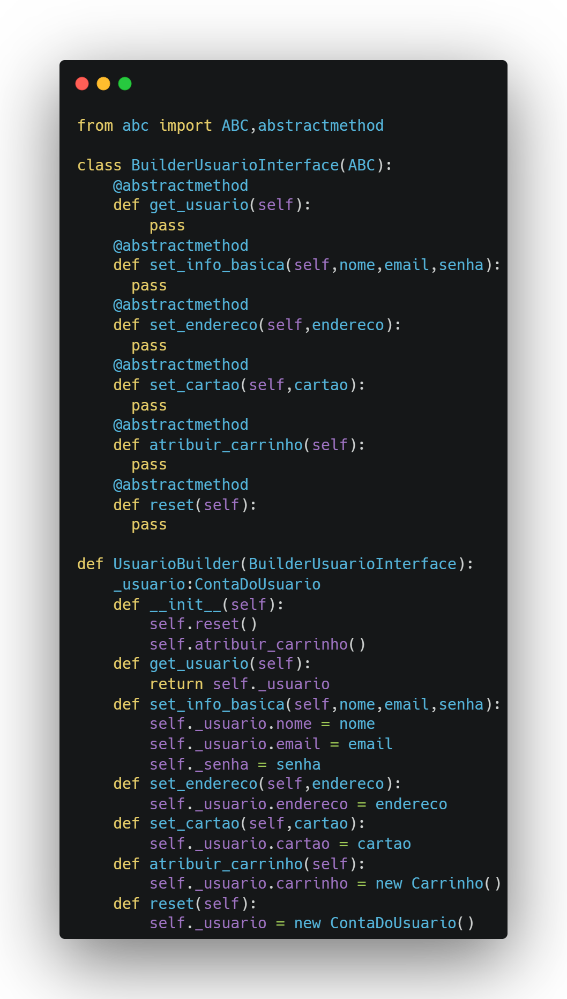
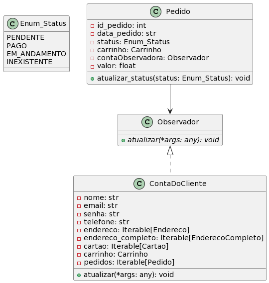
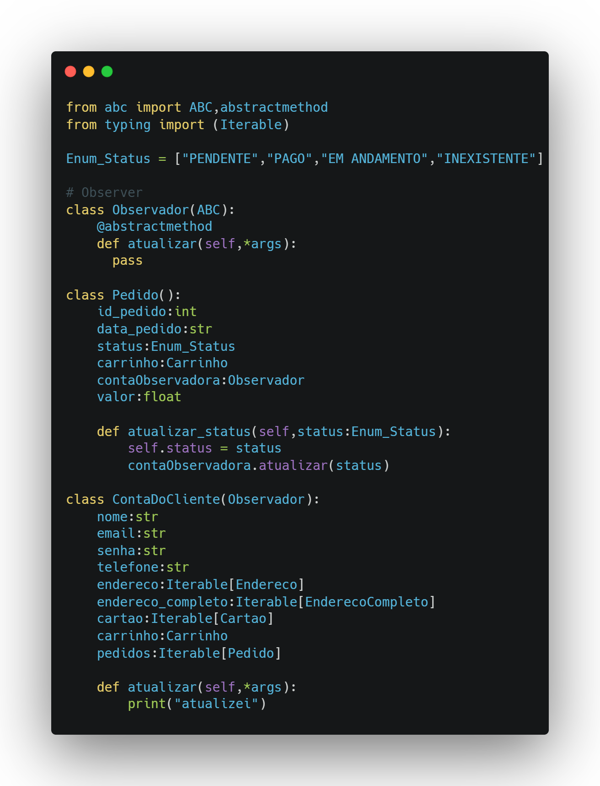

# Reutilização de software interno

## Introdução

Reutilização de Software tem várias definições, mas comumente consideramos que
ela é o uso de qualquer informação, item de software ou até softwares já
existentes que um desenvolvedor possa aproveitar na criação de um
sistema[1](https://blog.casadodesenvolvedor.com.br/reutilizacao-de-software/).
Dito isso, esse documento tem como objetivo evidenciar todo o processo de
reutilização interna do software que foi desenvolvido.

## Metodologia

Para a produção do artefato, a equipe elicitou os [requisitos de
software](https://unbarqdsw2023-2.github.io/2023.2_G1_ProjetoAmazon/Entregas/Um/index.html),
com isto, realizou a [modelagem do
software](https://unbarqdsw2023-2.github.io/2023.2_G1_ProjetoAmazon/Entregas/Dois/index.html)
a ser desenvolvido com base na etapa anterior, e assim, desenvolveu o software
da disciplina utilizando padrões de projeto e uma [arquitetura
MVC](https://github.com/UnBArqDsw2023-2/2023.2_G1_ProjetoAmazon/blob/main/docs/ArquiteturaReutilizacao/reutilizacao/Arquitetura.md).
Assim, este documento sumariza todos esses processos.

## Processo

### Base

A equipe realizou o processo de engenharia de requisitos utilizando uma
[design sprint](https://unbarqdsw2023-2.github.io/2023.2_G1_ProjetoAmazon/Entregas/Um/DesignSprint.html)
em conjunto com as técnicas:

- Elicitação: Processo responsável por coletar os requisitos de um software que está por vir, por se tratar do primeiro passo na engenharia de requisitos, é de suma importância que seja feita de maneira metodológica e correta, com documentação de todas as tecnicas. As técnicas dessa etapa foram:
  - [5W2H](https://unbarqdsw2023-2.github.io/2023.2_G1_ProjetoAmazon/Entregas/Um/5W2H.html)
  - [BrainStorming](https://unbarqdsw2023-2.github.io/2023.2_G1_ProjetoAmazon/Entregas/Um/Brainstorm.html)
  - [Entrevista](https://unbarqdsw2023-2.github.io/2023.2_G1_ProjetoAmazon/Entregas/Um/Entrevista.html)
  - [Mapa mental](https://unbarqdsw2023-2.github.io/2023.2_G1_ProjetoAmazon/Entregas/Um/MapaMental.html)
  - [Rich Picture](https://unbarqdsw2023-2.github.io/2023.2_G1_ProjetoAmazon/Entregas/Um/RichPicture.html)
  - [StoryBoard](https://unbarqdsw2023-2.github.io/2023.2_G1_ProjetoAmazon/Entregas/Um/StoryBoard.html)
  
- Priorização: Processo que o PO e stakeholders se juntam aos desenvolvedores e realizam uma qualificação dos requisitos elicitados na etapa anterior afim de obter os requisitos mais urgentes.As técnicas dessa etapa foram: 
  - [TLS](https://unbarqdsw2023-2.github.io/2023.2_G1_ProjetoAmazon/Entregas/Um/TLS.html)

- Modelagem de requisitos: Processo que realiza uma transformação nos requisitos para uma linguagem mais fácil e adequada para o desenvolvimento do software. As técnicas dessa etapa foram: 
    - [Backlog](https://unbarqdsw2023-2.github.io/2023.2_G1_ProjetoAmazon/Entregas/Um/Backlog.html)
    - [Léxicos](https://unbarqdsw2023-2.github.io/2023.2_G1_ProjetoAmazon/Entregas/Um/Lexicos.html)
    - [BPMN](https://unbarqdsw2023-2.github.io/2023.2_G1_ProjetoAmazon/Entregas/Um/BPMN.html)

A equipe também produziu um
[Plano de Risco](https://unbarqdsw2023-2.github.io/2023.2_G1_ProjetoAmazon/Entregas/Um/PlanoDeRisco.html#tecnico)
no qual tem a finalidade de produzir um pensamento estratégico perante a riscos
e incertezas no projeto. Após isto, foi produzido um
[protótipo](https://unbarqdsw2023-2.github.io/2023.2_G1_ProjetoAmazon/Entregas/Um/Prototipo.html)
no qual foi
[validado](https://unbarqdsw2023-2.github.io/2023.2_G1_ProjetoAmazon/Entregas/Um/EntrevistaValidacao.html)
dias após.

## Padrões de Projeto

Na segunda entrega, foi desenvolvido duas classes de diagramas, os
estáticos(classes, pacotes, componentes e implantação) e os
dinâmicos(estados,sequência, atividade e comunicação). O
[diagrama de pacotes](https://unbarqdsw2023-2.github.io/2023.2_G1_ProjetoAmazon/Entregas/Dois/DiagramaDePacotes/DiagramaDePacotes.html)
evidência uma visão sobre a arquitetura do software que será utilizado,
definindo um frontend e um backend que são ligados por um controlador.

Dando um enfoque maior no
[diagrama de classes](https://unbarqdsw2023-2.github.io/2023.2_G1_ProjetoAmazon/Entregas/Dois/DiagramaDeClasses/DiagramaDeClasses.html),
podemos listar alguns casos de possíveis reutilizações do software.

### 1 - **Proxy**: 

No diagrama 1 podemos observar a implementação de um Proxy que
checa se o usuário está autenticado antes de realizar qualquer operação. Isso é
importante para garantir que somente usuários autenticados possam fazer
operações que modificam o carrinho, já que não existe carrinho que não é
associado a um usuário já existente.

    
    
 Diagrama 1 (Fonte: Autor, 2023).

### 1.1- Implementação **Proxy**: 
A implementação desse padrão está evidenciada na imagem 1:

    
    
 Imagem 1 (Fonte: Autor, 2023).

O proxy faz o controle de acesso por meio do método `has_acess`, e possui uma
instância da classe concreta `CartService`. Ambas implementam o protocol
`CartServiceProtocol`.

### 2 - **Strategy**: 
No diagrama 2, pode-se encontrar a classe concreta pagamento e 3
classes que herdam dela: pix, boleto ou outras. No contexto da aplicação, é
importante que o usuário autenticado possa escolher qual o método de pagamento
que ele irá utilizar para obter o produto, sendo assim, o padrão strategy se
encaixa nessa situação.

    
    
 Diagrama 2 (Fonte: Autor, 2023).

### 2.2- Implementação **Strategy**: 
A implementação do padrão Strategy está descrita na imagem 2.
Esse padrão permite o alto desacoplamento da funcionalidade relacionada ao
pagamento utilizando diversos métodos de pagamento diferentes.

    
    
 Imagem 2 (Fonte: Autor, 2023).

Como em python não temos explicitamente classes abstratas ou interfaces, a
classe CreditCardPaymentMethod realizou uma herança da classe PaymentMethod, e
assim, a mesma foi implementada com seus atributos e futuramente métodos. A
ideia é expandir o padrão para os outros tipos de pagamento e adicinar classes
como PIXPaymentMethod ou TicketPaymentMethod tendo a mesma estrutura que a
classe CreditCardPaymentMethod.

Além disso, essas classes já criam suas respectivas tabelas no banco de dados,
gerando uma relação de especialização entre os métodos de pagamento. Isso
permite que um serviço opere usando somente a noção abstrata de um método de
pagamento, mas ainda assim conseguindo acessar seus respectivos dados. Isso é
útil em situações onde não é preciso saber o método de pagamento específico.

Vale lembrar que durante o diagrama de classes podemos encontrar exemplos de
GRASPs como polimorfismo afim de garantir um baixo acoplamento e alta coesão.
Um exemplo claro já foi descrito na imagem 2 que é o de uma herança das classes
pix, boleto e outras com a classe pagamento.

## Considerações finais

A implementação dos padrões de projeto Proxy e Strategy, aplicados ao escopo da disciplina, pode ser conferida no [repositório da disciplina](https://github.com/UnBArqDsw2023-2/2023.2_G1_ProjetoAmazon/tree/main/src). 

### Modelagem e Reutilização

**[Proxy](#padrões-de-projeto)**: Foi implementado um Proxy para verificar a autenticação do usuário antes de permitir operações no carrinho. Isso garante que apenas usuários autenticados possam modificar o carrinho.

**[Strategy](#padrões-de-projeto)**: A implementação do padrão Strategy foi evidenciada no contexto de métodos de pagamento. A classe concreta de pagamento permitiu a criação de subclasses como PIX, boleto, entre outras, proporcionando flexibilidade na escolha do método de pagamento.

**Flyweight, Builder, Observer (Não Implementados dentro do projeto)**: Reconhecemos a oportunidade de explorar os padrões Flyweight, Builder e Observer para aprimorar a arquitetura do software. No contexto do perfil do comprador na Amazon, esses padrões poderiam ser aplicados da seguinte forma:

- `Flyweight`: Neste padrão de projeto, temos como objetivo colocar mais objetos na quantidade de RAM disponível ao compartilhar partes comuns de estado entre múltiplos objetos ao invés de manter todos os dados em cada objeto. Neste caso, fizemos uma simplificação da classe endereço que estava contida dentro da classe contaDoUsuario, nele nos abstraimosa classe pesada e deixamos apenas atributos essenciais, ja na classe EnderecoCompleto temos atributos que são derivados daqueles atributos que estão na classe endereço.

  
Diagrama e Código - Flyweight

  

    
    
 Diagrama 4 (Fonte: Autor, 2023).

  

      
      
 Imagem 3 (Fonte: Autor, 2023).

  

- `Builder`: Para melhorar a velocidade de criação do usuário, há a necessidade de cria-lo utilizando o padrão builder, tal padrão se utiliza de uma interface que define oe metodos que serão implementados no builder concreto. O builder concreto é justamente a classe UsuarioBuilder, na qual implementa todos os métodos da interface. Alguns métodos notáveis que podemos destacar são :

    - Inicializador: Inicia com um reset e atribuindo um carrinho para o usuário, já que não há a necessidade de um processo maior para a construição do mesmo.
    - Reset: Realiza a instânciação de um novo usuário.
    - Get Usuário: retorna o usuário
    - Demais metodos: implementam lentamente o usuário

  
Diagrama e Código - Builder

    
    
 Diagrama 4 (Fonte: Autor, 2023).

  

    
    
 Imagem 4 (Fonte: Autor, 2023).

- `Observer`: O usuário necessita saber a situação do seu pedido, sendo assim, há a necessidade de implementar o padrão observer. No exemplo acima, foi criado uma interface chamada observador, no qual irá observar determinada classe. A classe observada é Pedido no qual tem um método que notifica todas as classes que desejam observa-la, assim, a classe ContaDoUsuario é notificada e atualiza seu status.

  
Diagrama e Código - Observer

    
    
 Diagrama 5 (Fonte: Autor, 2023).

  

    
    
 Imagem 5 (Fonte: Autor, 2023).

Embora tenhamos aplicado com sucesso os padrões Strategy e Proxy, reconhecemos que outros padrões como Flyweight, Builder e Observer poderiam ser explorados para aprimorar ainda mais a arquitetura do software. 

Além disso, é importante resaltar que foi utilizado módulos prontos do Django, como autenticação, renderização, entre outros, foram utilizados, evidenciando a importância da reutilização de software não apenas a nível de código, mas também de frameworks e bibliotecas.

## Referências
‌
>[1]  SILVEIRA, Samara. A reutilização de software e suas aplicações. Disponível em: &#60;https://blog.casadodesenvolvedor.com.br/reutilizacao-de-software/&#62;. Acesso em: 29 nov 2023. 
>[2] PlantUML Web Server. Disponível em: <https://www.plantuml.com>. Acesso em: 1 dez. 2023.

## Histórico de versão

| Versão | Data       | Descrição                        | Autor(es) | Revisor(es) |
| ------ | ---------- | -------------------------------- | --------- | ----------- |
| `1.0`  | 29/11/2023 | Iniciando o documento            | Kauã      | Ana         |
| `1.1`  | 30/11/2023 | Adicionando informações          | Kauã      | Ana         |
| `1.2`  | 30/11/2023 | Informações sobre especialização | Guilherme | Arthur      |
| `1.3`  | 01/12/2023 | Alterações no documento          | Kauã e Ana| Beatriz     |
| `1.4`  | 01/12/2023 | Melhoria dos Diagramas           | Guilherme | Arthur      |
| `1.5`  | 01/12/2023 | Adição dos padrões e diagramas   | Ana e Kauã| Beatriz     |

