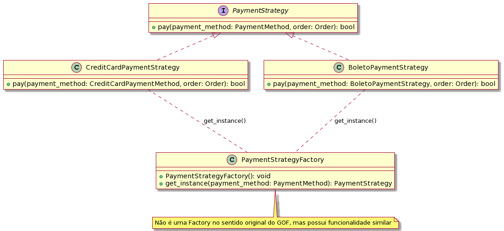

# Reutilização de software interno

## Introdução

Reutilização de Software tem várias definições, mas comumente consideramos que
ela é o uso de qualquer informação, item de software ou até softwares já
existentes que um desenvolvedor possa aproveitar na criação de um
sistema[1](https://blog.casadodesenvolvedor.com.br/reutilizacao-de-software/).
Dito isso, esse documento tem como objetivo evidenciar todo o processo de
reutilização interna do software que foi desenvolvido.

## Metodologia

Para a produção do artefato, a equipe elicitou os [requisitos de
software](https://unbarqdsw2023-2.github.io/2023.2_G1_ProjetoAmazon/Entregas/Um/index.html),
com isto, realizou a [modelagem do
software](https://unbarqdsw2023-2.github.io/2023.2_G1_ProjetoAmazon/Entregas/Dois/index.html)
a ser desenvolvido com base na etapa anterior, e assim, desenvolveu o software
da disciplina utilizando padrões de projeto e uma [arquitetura
MVC](https://github.com/UnBArqDsw2023-2/2023.2_G1_ProjetoAmazon/blob/main/docs/ArquiteturaReutilizacao/reutilizacao/Arquitetura.md).
Assim, este documento sumariza todos esses processos. 

## Processo

### Base

A equipe realizou o processo de engenharia de requisitos utilizando uma
[design sprint](https://unbarqdsw2023-2.github.io/2023.2_G1_ProjetoAmazon/Entregas/Um/DesignSprint.html)
em conjunto com as técnicas:

- Elicitação: Processo responsável por coletar os requisitos de um software que está por vir, por se tratar do primeiro passo na engenharia de requisitos, é de suma importância que seja feita de maneira metodológica e correta, com documentação de todas as tecnicas. As técnicas dessa etapa foram:
  - [5W2H](https://unbarqdsw2023-2.github.io/2023.2_G1_ProjetoAmazon/Entregas/Um/5W2H.html)
  - [BrainStorming](https://unbarqdsw2023-2.github.io/2023.2_G1_ProjetoAmazon/Entregas/Um/Brainstorm.html)
  - [Entrevista](https://unbarqdsw2023-2.github.io/2023.2_G1_ProjetoAmazon/Entregas/Um/Entrevista.html)
  - [Mapa mental](https://unbarqdsw2023-2.github.io/2023.2_G1_ProjetoAmazon/Entregas/Um/MapaMental.html)
  - [Rich Picture](https://unbarqdsw2023-2.github.io/2023.2_G1_ProjetoAmazon/Entregas/Um/RichPicture.html)
  - [StoryBoard](https://unbarqdsw2023-2.github.io/2023.2_G1_ProjetoAmazon/Entregas/Um/StoryBoard.html)
  
- Priorização: Processo que o PO e stakeholders se juntam aos desenvolvedores e realizam uma qualificação dos requisitos elicitados na etapa anterior afim de obter os requisitos mais urgentes.As técnicas dessa etapa foram: 
  - [TLS](https://unbarqdsw2023-2.github.io/2023.2_G1_ProjetoAmazon/Entregas/Um/TLS.html)

- Modelagem de requisitos: Processo que realiza uma transformação nos requisitos para uma linguagem mais fácil e adequada para o desenvolvimento do software. As técnicas dessa etapa foram: 
    - [Backlog](https://unbarqdsw2023-2.github.io/2023.2_G1_ProjetoAmazon/Entregas/Um/Backlog.html)
    - [Léxicos](https://unbarqdsw2023-2.github.io/2023.2_G1_ProjetoAmazon/Entregas/Um/Lexicos.html)
    - [BPMN](https://unbarqdsw2023-2.github.io/2023.2_G1_ProjetoAmazon/Entregas/Um/BPMN.html)

A equipe também produziu um
[Plano de Risco](https://unbarqdsw2023-2.github.io/2023.2_G1_ProjetoAmazon/Entregas/Um/PlanoDeRisco.html#tecnico)
no qual tem a finalidade de produzir um pensamento estratégico perante a riscos
e incertezas no projeto. Após isto, foi produzido um
[protótipo](https://unbarqdsw2023-2.github.io/2023.2_G1_ProjetoAmazon/Entregas/Um/Prototipo.html)
no qual foi
[validado](https://unbarqdsw2023-2.github.io/2023.2_G1_ProjetoAmazon/Entregas/Um/EntrevistaValidacao.html)
dias após.

### Modelagem

Na segunda entrega, foi desenvolvido duas classes de diagramas, os
estáticos(classes, pacotes, componentes e implantação) e os
dinâmicos(estados,sequência, atividade e comunicação). O
[diagrama de pacotes](https://unbarqdsw2023-2.github.io/2023.2_G1_ProjetoAmazon/Entregas/Dois/DiagramaDePacotes/DiagramaDePacotes.html)
evidência uma visão sobre a arquitetura do software que será utilizado,
definindo um frontend e um backend que são ligados por um controlador.

Dando um enfoque maior no
[diagrama de classes](https://unbarqdsw2023-2.github.io/2023.2_G1_ProjetoAmazon/Entregas/Dois/DiagramaDeClasses/DiagramaDeClasses.html),
podemos listar alguns casos de possíveis reutilizações do software.

1 - **Proxy**: na diagrama 1, podemos ver que a classe carrinho tem uma relação
simples com uma conta de usuário,sendo assim , para a aplicação é importante
que o usuário só tenha acesso a este recurso caso ele esteja autenticado no
sistema, caso não, ele deve ser barrado ao tentar acessar este recurso, assim,
o padrão de projeto proxy é o ideal para esta situação.

    
    
 Diagrama 1 (Fonte: Autor, 2023).

2 - **Strategy**: na diagrama 2, pode-se encontrar a classe concreta pagamento e 3
classes que herdam dela: pix, boleto e cartão. No contexto da aplicação, é
importante que o usuário autenticado possa escolher qual o método de pagamento
que ele irá utilizar para obter o produto, sendo assim, o padrão strategy se
encaixa nessa situação.

    
    
 Diagrama 2 (Fonte: Autor, 2023).

Vale lembrar que durante o diagrama de classes podemos encontrar exemplos de
GRASPs como polimorfismo afim de garantir um baixo acoplamento e alta coesão.
Um exemplo claro já foi descrito na imagem 1 que é o de uma herança das classes
pix, boleto e cartão com a classe pagamento.

3 - **Flyweight**: no diagrama 3, ...........................

    
    
 Diagrama 3 (Fonte: Autor, 2023).

3 - **Flyweight**: no diagrama 4, ...........................

    
    
 Diagrama 4 (Fonte: Autor, 2023).

### Padrões de Projeto

Por fim, os padrões de projeto são uma concretização da reutilização de
software. A seguir, podemos ver como foram implementadas os padrões de projeto
descritos na seção anterior deste documento:

1- **Strategy**: No momento da produção deste artefato, o padrão ainda não está
totalmente concluido. A implementação desse padrão está evidenciada na imagem 3:

    
    
 Imagem 2 (Fonte: Autor, 2023).

Como em python não temos explicitamente classes abstratas ou interfaces, a
classe CreditCardPaymentMethod realizou uma herança da classe PaymentMethod, e
assim, a mesma foi implementada com seus atributos e futuramente métodos. A
ideia é expandir o padrão para os outros tipos de pagamento e adicinar classes
como PIXPaymentMethod ou TicketPaymentMethod tendo a mesma estrutura que a
classe CreditCardPaymentMethod.

Além disso, essas classes já criam suas respectivas tabelas no banco de dados,
gerando uma relação de especialização entre os métodos de pagamento. Isso
permite que um serviço opere usando somente a noção abstrata de um método de
pagamento, mas ainda assim conseguindo acessar seus respectivos dados. Isso é
útil em situações onde não é preciso saber o método de pagamento específico.

2- **Proxy**: A implementação desse padrão está evidenciada na imagem 4:

    
    
 Imagem 2 (Fonte: Autor, 2023).

Na classe de service, temos o método "has_access" no qual verifica se o usuário
está autenticado, senão, ele retorna uma excessão, se sim, retorna o usuário.
Na sequência, temos os métodos que atuam como a operação que desejamos guardar.

3- **Flyweight**: A implementação desse padrão está evidenciada na imagem 3:

    
    
 Imagem 3 (Fonte: Autor, 2023).

Neste padrão de projeto, temos como objetivo colocar mais objetos na quantidade de RAM disponível ao 
compartilhar partes comuns de estado entre múltiplos objetos ao invés de manter todos os dados em cada 
objeto. Neste caso, fizemos uma simplificação da classe endereço que estava contida dentro da classe ``contaDoUsuario``, nele nos abstraimosa classe pesada e deixamos apenas atributos essenciais, ja na classe ``EnderecoCompleto`` temos atributos que são derivados daqueles atributos que estão na classe endereço.

4- **Observer**: A implementação desse padrão esta evidenciada na imagem 4:

    
    
 Imagem 4 (Fonte: Autor, 2023).

[FAZER REFERENCIA AO REPOSITORIO]

## Referências
‌
>[1]  SILVEIRA, Samara. A reutilização de software e suas aplicações. Disponível em: &#60;https://blog.casadodesenvolvedor.com.br/reutilizacao-de-software/&#62;. Acesso em: 29 nov 2023. 

## Histórico de versão

| Versão | Data       | Descrição                        | Autor(es) | Revisor(es) |
| ------ | ---------- | -------------------------------- | --------- | ----------- |
| `1.0`  | 29/11/2023 | Iniciando o documento            | Kauã      | Ana         |
| `1.1`  | 30/11/2023 | Adicionando informações          | Kauã      | Ana         |
| `1.2`  | 30/11/2023 | Informações sobre especialização | Guilherme | Arthur      |
| `1.3`  | 01/12/2023 | Versão final do documento        | Kauã e Ana| Beatriz     |

