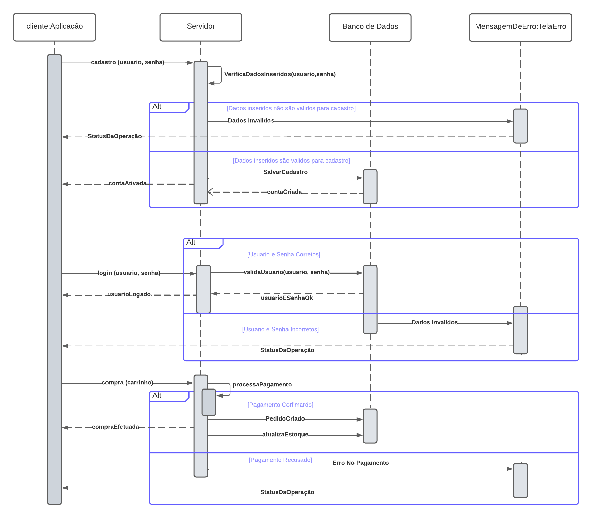
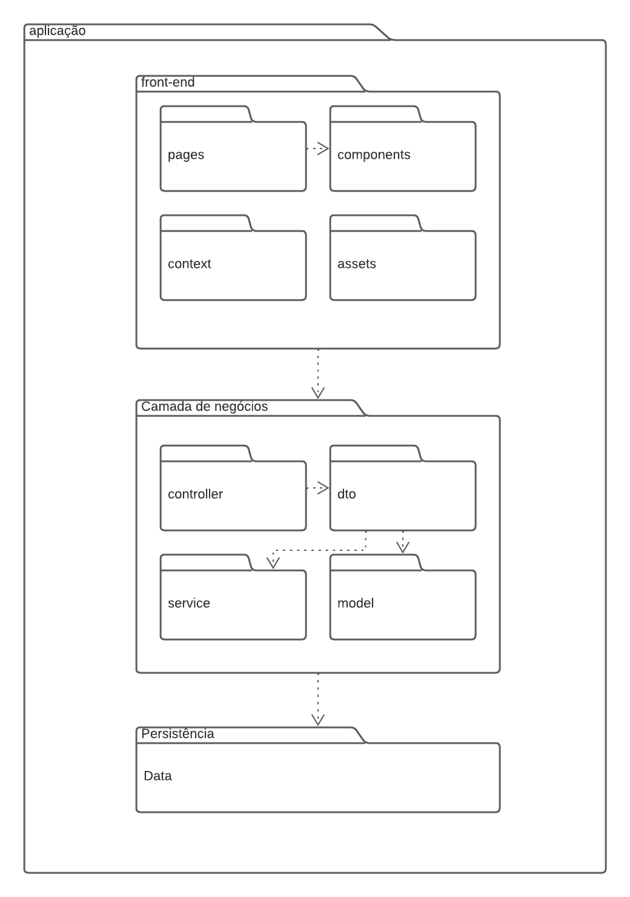
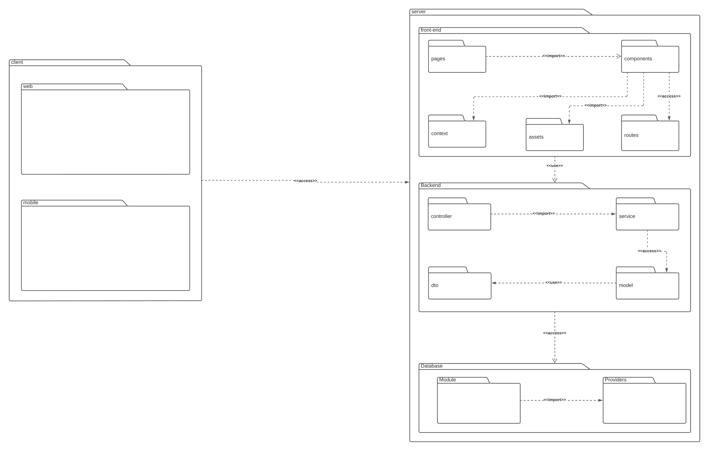
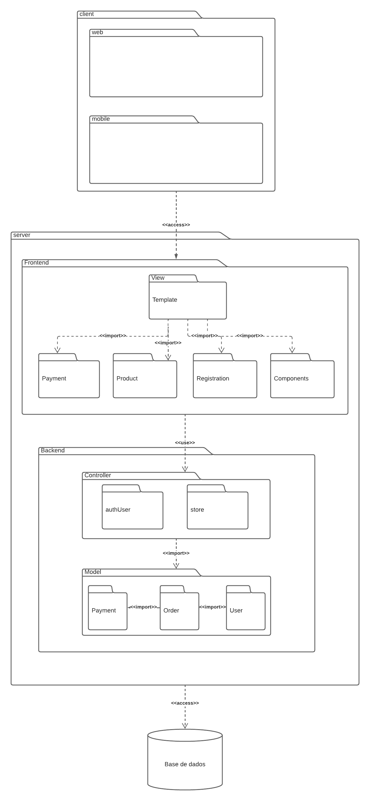

# Visão Lógica

## Introdução

A arquitetura de um software é representada por uma série de visões arquiteturais, as quais, em essência, são fragmentos que ilustram os elementos "significativos em termos de arquitetura" em modelos [1]. Portanto, as visões arquiteturais evidenciam aspectos do software de diferentes formas.

Visão Lógica apresenta a oragnização do software de modo mais estrutural, ondem são representados os elementos arquiteturais. Organização conceitual de um software em termos de camadas, subsistemas, pacotes, frameworks, classes, interfaces e realizações de caso de uso [1].

## Metodologia

Para a confecção da visão lógica da arquitetura, os membros responsáveis decidiram trazer uma visão por meio dos pacotes e Sequência. Com base no diagrama de pacotes e Sequência foi elaborado a visão lógica, elucidando pontos que foram consirados importantes na arquitetura de acordo com os autores. Foi utilizado o webapp [Lucidchart](https://www.lucidchart.com/pages/) para a confecção do artefato. Por fim, foi publicado o diagrama para os membros do grupo ficarem cientes do processo.

## Diagrama de Sequência

O diagrama de sequência é um diagrama de interação que mostra como os processos operam com um foco em sequência. Ele mostra objetos, classes e componentes envolvidos nas operações e a sequência de mensagens trocadas entre os objetos necessários para realizar a funcionalidade da operação.

 Diagrama de Sequência: Versão 2.0 (Fonte: Autores, 2023).</a>
 

## Diagrama de Pacotes

### Primeira versão

Primeira versão criada em 28/11/2023.

    
    
 Imagem 1: Visão Lógica, primeira versão (Fonte: Samuel, 2023).
 

### Segunda versão

Segunda versão criada em 30/11/2023.

    
    
 Imagem 2: Visão Lógica, segunda versão (Fonte: Autor, 2023).
 

Terceira versão criada em 01/12/2023.

    
    
 Imagem 2: Visão Lógica, segunda versão (Fonte: Autor, 2023).
 

## Referências

> [1] SLIDE AULA - Arquitetura e Desenho de Software - Aula Arquitetura e DAS - Parte II. Profa. Milene Serrano . Disponivel em: [aprender3](https://aprender3.unb.br/pluginfile.php/2649469/mod_label/intro/Arquitetura%20e%20Desenho%20de%20Software%20-%20Aula%20Arquitetura%20e%20DAS%20-%20Parte%20II%20-%20Profa.%20Milene.pdf). Acesso em 27 de nov. de 2023.
>
> [2] Diagrama de Seqüência. Disponivel em: [profs.ic.uff](http://profs.ic.uff.br/~viviane.silva/es1/util/aula8.pdf). Acesso em 4 de out. de 2023.

## Histórico de versão

| Versão |    Data    |                Descrição                 |     Autor     |    Revisor    |
| :----: | :--------: | :--------------------------------------: | :-----------: | :-----------: |
| `1.1`  | 28/11/2023 |Criação do documento e adição da imagem inicial |   Samuel Sato  |    Augusto D. Camargo   |
|`1.2`|30/11/2023|Adição do diagrama mais detalhado, sendo essa a sua versão final|Augusto D. Camargo| Samuel Sato|
|`1.3`|01/12/2023|Adição do diagrama de Sequencia|Beatriz| Samuel Sato|
|`1.4`|01/12/2023|Adição versão três visão lógica|Samuel Sato| Augusto D.|

