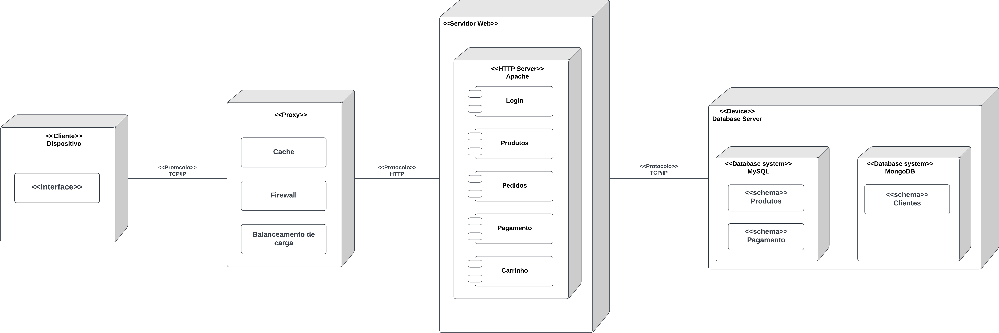

# Visão de Implementação/Implantação

## 1. Introdução

Ao contrário da Visão _da_ Implementação, que é uma visão de alto nível, que descreve a organização lógica do sistema, a Visão _de_ Implementação é uma visão de baixo nível, que descreve a distribuição física do processamento no sistema. Também conhecida como Visão de Implantação, ela descreve a arquitetura física do sistema, incluindo os nós de processamento, as conexões entre eles e os componentes de software que residem em cada nó.

## 3. Visão de Implantação

A visão de implantação do sistema é representada pelo seguinte diagrama:

    
    
 Figura 1 (Fonte: Autor, 2023).</a>
 

## Referências

> [1] . Disponível em: https://www.omg.org/spec/UML/2.0. Acesso em: [09 de outubro de 2023].
>
> [2] Exemplos de Diagrama de Implantação UML. Disponível em: https://www.edrawsoft.com/pt/deployment-chart-example.html. Acesso em: [29 de outubro de 2023].
>
> [3] O que é um diagrama de implementação?. Disponível em: https://www.lucidchart.com/pages/pt/o-que-e-diagrama-de-implementacao-uml. Acsso em: [29 de outubro de 2023].

## Histório de Versão

| Versão | Data       | Descrição            | Autores | Revisores |
| ------ | ---------- | -------------------- | ------- | --------- |
| `1.0`  | 28/11/2023 | Versão Inicial       | Arthur  | Bruno     |
| `1.0`  | 29/11/2023 | Adicionando diagrama | Bruno   | Arthur    |
