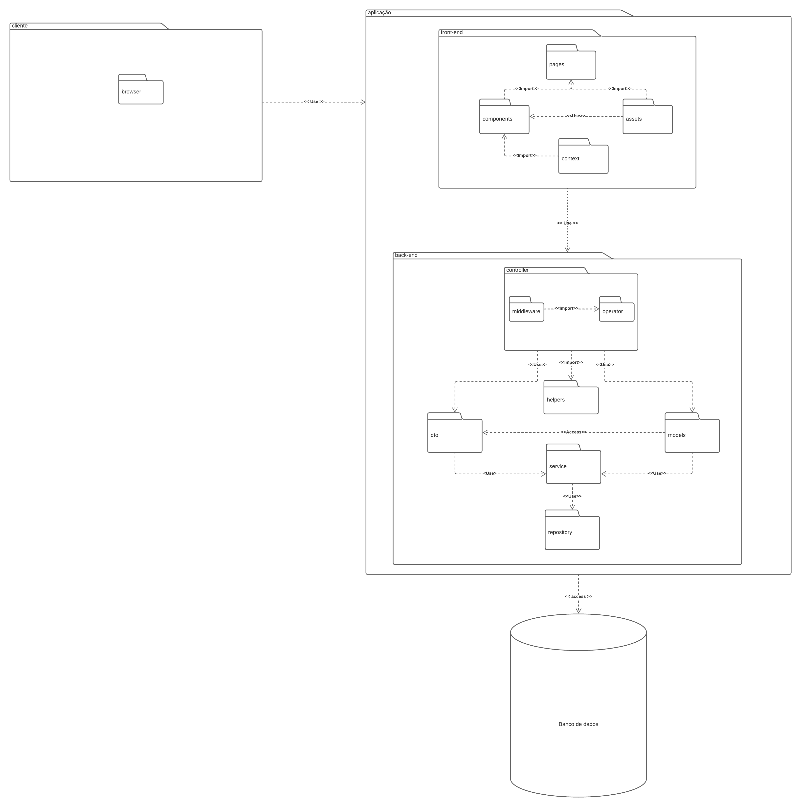
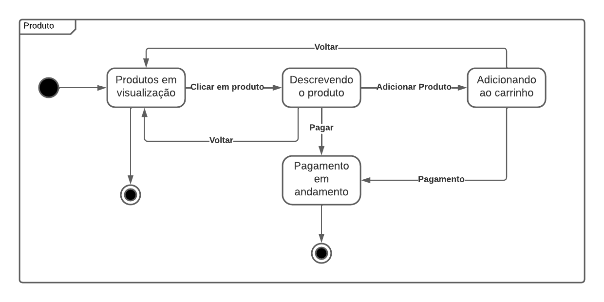
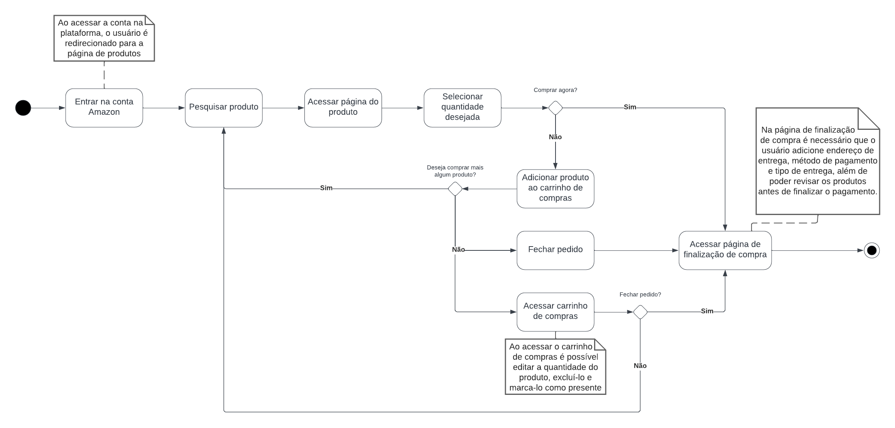
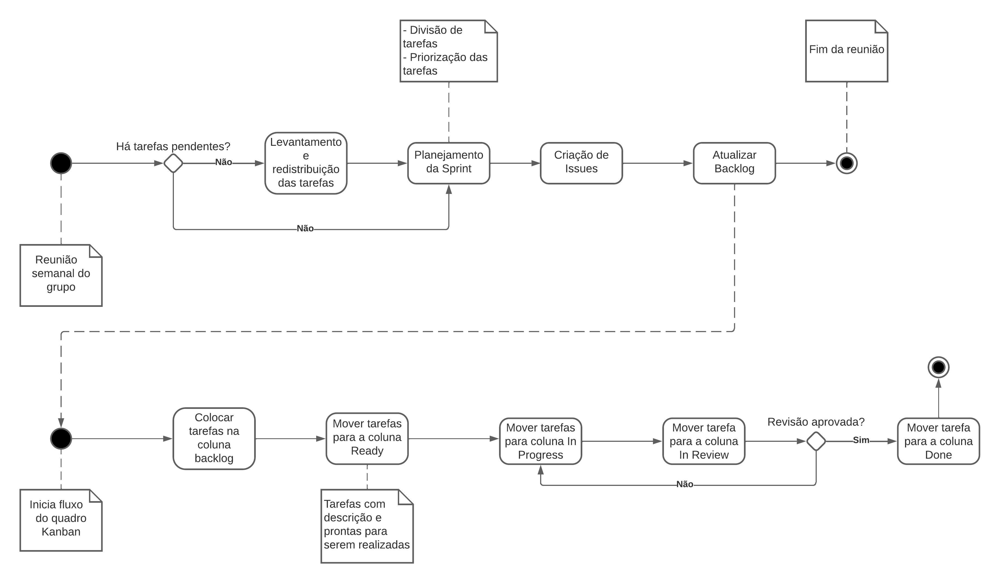
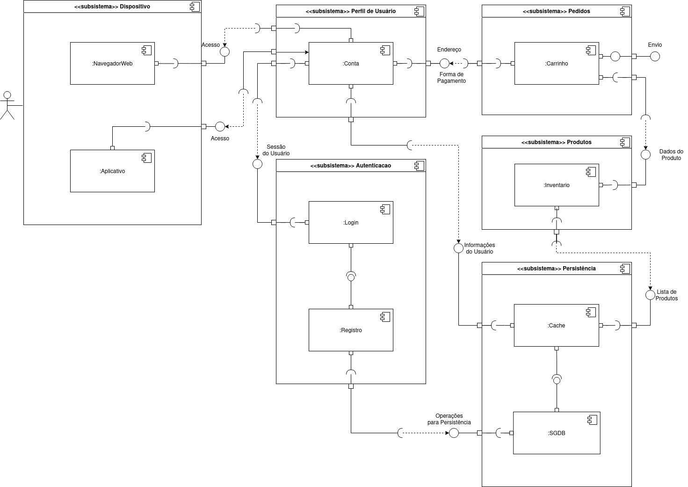

# DAS de implementação

## Contexto

A Amazon é uma plataforma e-commerce que oferece diversos serviços para o clientea. Através do site da Amazon, é possível fazer compras diante de um extenso catálogo de produtos e serviços oferecidos pela empresa.
O nosso grupo, da matéria de Arquitetura e desenho de software, ficou responsável por analisar a Amazon com foco no perfil comprador e fluxos compreendidos do cadastro na plataforma até visualização/compra/pagamento de produtos.

## Cenários-chave

### 5W2H

Essa abordagem deriva de sete perguntas simples, "What" (O quê), "Why" (Por quê), "Where" (Onde), "When" (Quando), "Who" (Quem), "How" (Como) e "How much" (Quanto custa). No caso do projeto da Amazon, foi utilizado para compreender melhor o escopo do projeto, quais eram os requisitos necessários. O documento pode ser acessado nesse [link](../Um/5W2H.md).

### Storyboard

Um Storyboard é uma representação gráfica que utiliza uma sequência de imagens ou quadros para representar uma série de eventos ou ações de um cenário específico. No contexto do grupo 1, foi utilizado na hora de elicitar requisitos. O documento e as imagens podem ser acessadas nesse [link.](../Um/StoryBoard.md).

### Rich Picture

O Rich Picture é uma ferramenta visual para expressar ideias e analisar problemas. Os artefatos elaborados são construídos de maneira informal, visando o fácil entendimento. Os rich pictures elaborados pela equipe podem ser vizualizados nesse [link](../Um/RichPicture.md).

### Mapa mental

Um mapa mental é uma representação visual que condensa conceitos e pensamentos de maneira gráfica, estabelecendo vínculos entre palavras e imagens que irradiam de um ponto central. O mapa mental elaborado pela equipe pode ser encontrado nesse [link](../Um/MapaMental.md).

### Protótipo

O protótipo é utilizado na validação dos requisitos elicitados por meio das técnicas acima. O documento desenvolvido na disciplina, relacionado a disciplina, pode ser acessado nesse [link](../Um/Prototipo.md).

### Entrevista

A entrevista foi utilizada na tecnica de elicitação e tem como objetivo realizar conversas estruturadas com stakeholders para entender melhor as necessidades e requisitos do sistema. O documento referente a esse artefato pode ser acessado nesse [link](../Um/Entrevista.md)

### BPMN

O BPMN (Business Process Model and Notation), é uma linguagem gráfica padronizada para representar processos de negócios. O BPMN pode ser acessado nesse [link](../Um/BPMN.md)

## Diagramas

  
Diagrama de Classes

  <h3>O Diagrama de Classes é uma ferramenta fundamental na UML (Unified Modeling Language) que oferece uma perspectiva 
abrangente da estrutura de um sistema orientado a objetos. O artefato referente a esse diagrama pode ser encontrado neste <a href="../Dois/DiagramaDeClasses/DiagramaDeClasses.html">link</a>.</h3>
  
  

    
 Diagrama 1 (Fonte: Ana e Beatriz, 2023).</a>
 
  

  
Diagrama de Pacotes

  <h3>É um diagrama estrutural e estático que tem como objeto mostrar a disposição de pacotes (conjunto de elementos) dentro do projeto. O artefato referente a esse diagrama pode ser encontrado neste <a href="../Dois/DiagramaDePacotes/DiagramaDePacotes.html">link</a>.</h3>
  
  

    
 Diagrama 2 (Fonte: Kauã e Mylena, 2023).</a>
 
  

  
Diagrama de Estados

  <h3>  É um diagrama comportamental e dinâmico. O diagrama de estados consiste em estados, transições, eventos e atividades. Eles são importantes na modelagem de comportamentos de interface, classe ou colaboração. Ele enfatiza a ordem dos eventos do comportamento de um objeto. O artefato referente a esse diagrama pode ser encontrado neste <a href="../Dois/DiagramaDeEstados/DiagramaDeEstados.html">link</a>.</h3>
  
  

    
 Diagrama 3 (Fonte: Kauã, Ana e Mylena 2023).</a>
 
  

  
Diagrama de Atividades

  <h3>O Diagrama de Atividade é uma variação do Diagrama de Estado, que contém essencialmente os comportamentos a serem realizados no sistema. O artefato referente a esse diagrama pode ser encontrado neste <a href="../Dois/DiagramaDeAtividade/DiagramaDeAtividade.html">link</a>.</h3>
  <h2>Diagrama de Atividades - Cadastro</h2>
  
  

    
 Diagrama 4 (Fonte: Bruno e Gabriel, 2023).</a>
 
  

  <h2>Diagrama de Atividades - Compras</h2>
  
  

    
 Diagrama 5 (Fonte: Bruno e Gabriel, 2023).</a>
 
  

  <h2>Diagrama de Atividades - Gestão</h2>
  
  

    
 Diagrama 6 (Fonte: Bruno e Gabriel, 2023).</a>
 
  

## Diagrama de Componentes

Sendo o Diagrama de Componentes uma das principais representações visuais no Documento de Arquitetura de Implementação, ele desempenha um papel crucial ao oferecer uma visão clara da organização e interconexões dos elementos-chave identificados no sistema. Cada componente é cuidadosamente representado, destacando suas responsabilidades específicas e as interações entre eles. 

Essa representação, além de simplificar a compreensão da estrutura do sistema, também fornece uma base sólida para a tomada de decisões ao longo do ciclo de vida do projeto, permitindo que a equipe de desenvolvimento e manutenção atue de maneira informada e eficaz.

O artefato completo referente a esse diagrama esta disponível neste [link](../Dois/DiagramaDeComponentes/DiagramaDeComponentes.md).

 

 Diagrama 7 (Fonte: Guilherme Puida, 2023).</a>
 

## Estrutura do código

A estrutura do código é uma parte essencial para compreender a implementação prática da reutilização de software interno. Nesta seção, apresentamos uma visão geral dos principais elementos da estrutura do código relacionado, com foco na reutilização de componentes específicos. Mais informaçẽos sobre a arquitetura utilizada no projeto pode ser acessada nos links abaixo.

## Fontes:

- [Arquitetura](./Arquitetura.md)
- [Reutilização de software interno](./Interna.md)
- [Reutilização de software externo](./VisaoExterna/VisaoExterna.md)

## Concideraçẽos Gerais

- Linguagem de Programação: Python.
- Arquitetura de Software: MVC.
- Padrão de proejto utilizado: Strategy e Proxy
  

## Referências

> [1] Documentos elaborados durante o semestre pelo grupo. Disponível em: <docs/>. Acesso em: 28 nov. 2023.
> [2] Arquitetura de software: Documentação. Disponível em: <https://edisciplinas.usp.br/pluginfile.php/134335/mod_resource/content/1/Aula13_ArquiteturaSoftware_02_Documentacao.pdf>. Acesso em: 28 nov. 2023
> [3] Vídeos aulas. Disponível no moodle da disciplina. Acesso em: 29. nov. 2023
> [4] Slide Arquitetura e Desenho de Software AULA - ARQUITETURA & DAS – PARTE II. Disponivel em: Aprender3. Acesso em 30 nov. 2023

## Histórico de versão

| Versão | Data       | Descrição                                      | Autor(es)   | Revisor(es) |
| ------ | ---------- | ---------------------------------------------- | ----------- | ----------- |
| `1.0`  | 28/11/2023 | Criação do documento                           | Mylena      | Beatriz     |
| `1.1`  | 29/11/2023 | Adicionando links e mais informações           | Mylena      | Beatriz     |
| `1.2`  | 30/11/2023 | Adicionando  diagramas e finalizando documento | Ana Beatriz | Beatriz     |
| `1.3`  | 01/12/2023 | Revisão final                                  | Arthur      | N/A         |
