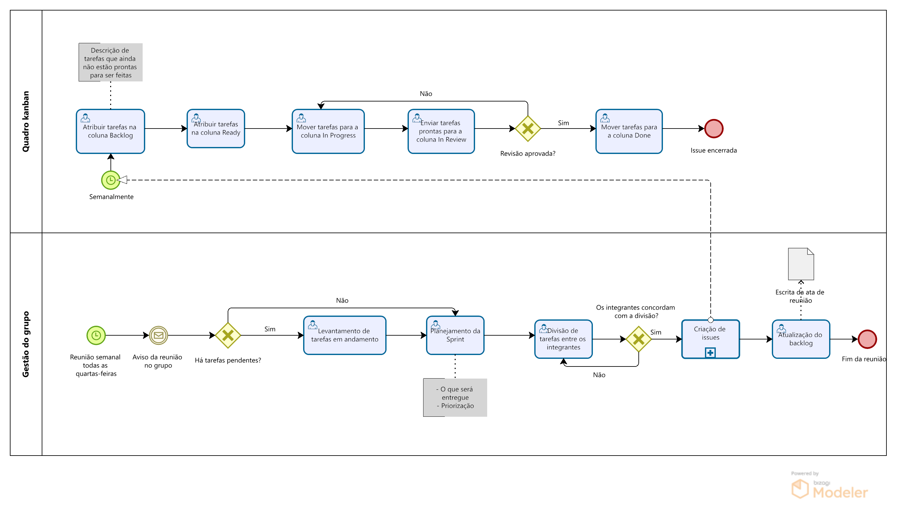

# BPMN

## Introdução & Objetivo

BPMN (Business Process Managemente Notation) é uma notação gráfica que tem por objetivo prover uma gramática de símbolos para mapear, de maneira padrão, todos os processos de negócio de uma organização. [1]

A notação BPMN auxilia no entendimento de processos e de atividades de acordo com o fluxo apresentado.

## Metodologia

Após as primeiras reuniões do grupo, entramos em um conssenso em relação as metodologias que serão utilizadas para o desenvolvimento do projeto ao longo da disciplina. Serão abordadas diferentes técnicas provenientes dos métodos _Scrum_ e _Kanban_.

### Scrum

O _Scrum_ é um método ágil iterativo utilizado para gerenciamento de projetos com foco em revisões constantes dos artefatos elaborados e coloboração mútua. Utilizaremos princípios e definições de _Sprints_, que são ciclos de desenvolvimento e revisões. A equipe optou por utilizar uma adaptação do scrum como metodologia de desenvolvimento devido a familiaridade dos integrantes com os ritos e atividades, principalmente com a Planning e Review.

Semanalmente haverá reunião de alinhamento, em cada reunião será realizado o planejamento da próxima sprint e review das atividades realizadas.

## 1. BPMN Metodologia

    
 Imagem 1: BPMN Metodologia (Fonte: Autor, 2023).

## 2. BPMN Cadastro

    
 Imagem 2: BPMN Cadastro (Fonte: Autor, 2023).

## 3. BPMN visualização de produtos, compra e pagamento

    
 Imagem 3: BPMN visualização de produtos, compra e pagamento (Fonte: Autor, 2023).

## Referências Bibliográficas

> [1] SGANdDERLA, Kelly. Um guia para iniciar estudos em BPMN (I): Atividades e sequência, 19 de novembro de 2012; http://blog.iprocess.com.br/2012/11/um-guia-para-iniciar-estudos-em-bpmn-i-atividades-e-sequencia/

## Histórico de Versão

| Versão | Data       | Descrição                                                         | Autor(es) | Revisor(es) |
| ------ | ---------- | ----------------------------------------------------------------- | --------- | ----------- |
| `1.0`  | 14/09/2023 | Adição da introdução e BPMN de cadastro                           | Samuel    | Bruno       |
| `1.1`  | 14/09/2023 | Padronização do documento                                         | Kauã      | Samuel      |
| `1.2`  | 14/09/2023 | Adição da metodologia                                             | Gabriel   | Arthur      |
| `2.0`  | 15/09/2023 | Migração para o MkDocs                                            | Arthur    | Gabriel     |
| `2.1`  | 15/09/2023 | Atualização do diagrama de metodologia e escolhas metodológicas   | Gabriel   |             |
