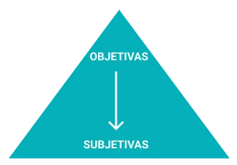

# Entrevista

## Introdução

Neste artefato, está descrita a tecnica de elicitação: "Entrevista". Essa tecnica é a mais conhecida e envolve discussões individuais com os stakeholders, ela é muito poderosa por ser um método verbal fácil e efetivo de se obter informações. Como Entrevistador, deve-se estar sempre aberto a novas ideias, além de estimular o entrevistado a participar de um diálogo com questões que atingem o ponto em comum desejado.
Para a realização da entrevista, foi apresentado para os entrevistados o [termo de consentimento](https://docs.google.com/document/d/1UvqmlaHauq9a1J6Ixsz-MRxIhAP51uipcxEwMAeUxjA/edit?usp=sharing), o qual afirma que os entrevistados autorizam a utilização de sua voz e imagem para a realização do processo.

## Metodologia

Para a realização da entrevista, foi utilizado um modelo pirâmide, no qual inicia-se com perguntas mais objetivas e, com o decorrer do evento, mais perguntas subjetivas são realizadas, naturalmente é um modelo que é mais util quando o entrevistado se sente relutante em relação a determinadas situações. A estrutura é descrita visualmente na imagem abaixo:

    
    
 Figura 1: Modelo pirâmidal de entrevista . Fonte: <a href="https://victorstati.medium.com/t%C3%A9cnicas-para-levantamento-de-requisitos-4907975498ac">Medium</a>
 

Para as perguntas objetivas, foi utilizada a técnica 5W2H para encontrar metodologicamente os questionamentos que seriam feitos. Já as perguntas subjetivas foram realizadas de acordo com as respostas do entrevistado.

## Perguntas realizadas

Para as perguntas objetivas, utilizou o 5W2H que é uma técnica de gerenciamento de projetos que ajuda a garantir que todos os aspectos relevantes de uma tarefa ou projeto sejam considerados e planejados de maneira adequada. A técnica 5W2H consiste basicamente em responder 7 perguntas simples para identificar e planejar os principais aspectos de uma tarefa ou projeto. São elas apresentadas na tabela 1:

| Acrônimo | Pergunta |
| -------- | -------- |
| What     | O quê    |
| Why      | Por quê  |
| Who      | Quem     |
| When     | Quando   |
| Where    | Onde     |
| How      | Como     |
| How much | Quanto   |

 Tabela 1: Acrônimos da técnica 5W2H (Fonte: <a href="https://github.com/ananorberto">Ana Beatriz</a>, 2023).

Com base nisso, a tabela 2 apresenta as perguntas escolhidas para a entrevista:

| Acrônimo | Pergunta                                                                                                                                                   |
| -------- | ---------------------------------------------------------------------------------------------------------------------------------------------------------- |
| What     | O quê você acha que pode melhorar na tela de comprador da Amazon?                                                                                          |
| Why      | Por que você tem ou teria a preferência pela Amazon em relação a outras plataformas de e-commerce?                                                         |
| Who      | Além de você, quem da sua família também faz compras pela Amazon?                                                                                          |
| When     | Quando você se sente motivado a fazer compras através de uma empresa de e-commerce?                                                                        |
| Where    | Por onde você normalmente faz compras na Amazon? Celular, computador ou outro?                                                                             |
| How      | Como você acha que seria o desenho de um fluxo “ideal” para um aplicativo de e-commerce? Inicie a partir da main page do site, até o pagamento do produto. |
| How much | Quanto tempo você acha que é o ideal para você realizar todo o processo de visualização, compra e pagamento dos produtos que você deseja?                  |

 Tabela 2: Perguntas objetivas(Fonte: Autor, 2023).

## Dados demográficos do entrevistado

Para uma entrevista, é necessário entender o perfil dos entrevistados. A tabela 3 apresenta os dados demográficos do indivíduo entrevistado.

| Nome          | Idade | Gênero    | Escolaridade             | Ocupação  | Estado civil |
| ------------- | ----- | --------- | ------------------------ | --------- | ------------ |
| Vinicíus Mota | 20    | Masculino | Ensino Superior Completo | Estudante | Solteiro     |

 Tabela 3: Dados demográficos do entrevistado (Fonte: Autor, 2023).

## Entrevistas

Segue os vídeos e a transcrição das respostas do entrevistado:
[Entrevista](https://youtu.be/TAgHgiB5rrc)

   
Respostas entrevistado

   <table>
      <thead>
         <tr>
            <th>Questões</th>
            <th>Respostas</th>
         </tr>
      </thead>
      <tbody>
         <tr>
            <td>1 - Por que você tem/teria a preferência pela Amazon em relação a outras plataformas de e-commerce?</td>
            <td>Pelo fato da Amazon já ter uma estrutura robusta de estoque e gerenciamento, além do ótimo histórico de vendas.</td>
         </tr>
         <tr>
            <td>2 - Por onde você normalmente faz compras na Amazon? Celular, computador ou outro? </td>
            <td>Normalmente pelo computador, pelo costume de usar as extensões que me avisam sobre promoções, além dos registros de cartões já estarem salvos nele.</td>
         </tr>
          <tr>
            <td>2.1 - Você sente alguma falta da Amazon em relação ao seu aplicativo ou Website? </td>
            <td>Acho um sistema bem completo, mas com informação demais. O layout é bem poluído.</td>
         </tr>
         <tr>
            <td>3 - Quando você se sente motivado a fazer compras através de uma empresa de e-commerce? </td>
            <td>Acredito muito que o estilo minimalista de se viver agrega bastante a nossa vida, então só compro no caso de necessidade para mim ou para presentear alguém importante para mim.</td>
         </tr>
         <tr>
            <td>4 - Além de você, quem da sua família também faz compras pela Amazon?</td>
            <td>Minha família inteira costuma comprar pela Amazon, pelos mesmos motivos que os meus.</td>
         </tr>
         <tr>
            <td>5 - Como você acha que seria o desenho de um fluxo “ideal” para um aplicativo de e-commerce? Inicie a partir da main page do site, até o pagamento do produto.</td>
            <td>A filtragem do site já é muito bem otimizada, entretanto acho que o sistema mostra muitas informações desnecessárias que fazem usuários menos focados e mais suscetíveis cogitar e até comprar outros produtos que, a princípio, não seriam o objetivo da compra.</td>
         </tr>
         <tr>
            <td>5.1 - Neste caminho, você acha que tem algo que possa ser reduzido?</td>
            <td>Podemos retirar as sugestões que aparecem embaixo do produto, se remover isso, pode-se despoluir mais a tela.</td>
         </tr>
         <tr>
            <td>6 - O quê você acha que pode melhorar na tela de comprador da Amazon? </td>
            <td>Acho que a tela da Amazon é muito poluída no sentido de informações, principalmente quando clicamos em um produto, que logo abaixo aparecem sugestões de compra de produtos relacionados. Eu até entendo que isso é interessante para a Amazon pois o objetivo da empresa é fazer a gente comprar mais, mas como disse antes, não sou adepto ao consumismo exagerado e desnecessário.</td>
         </tr>
        <tr>
            <td>6.1 - Há mais alguma coisa que te deixa desconfortável na interface da amazon?</td>
            <td>O site está dentro do design da Amazon, entretanto, não vejo que é um design atrativo ao comprador, a paleta de cores não está correta e o site está bem poluído.</td>
         </tr>
         <tr>
            <td>7 - Quanto tempo você acha que é o ideal para você realizar todo o processo de visualização, compra e pagamento dos produtos que você deseja?</td>
            <td>Se estou pesquisando um produto então já estou disposto a compra-lo e com dinheiro já disponível. Então eu apenas abro as ofertas disponíveis e compro aquela mais em conta, acredito que cerca de 10 minutos.</td>
         </tr>
         <tr>
            <td>7.1 - Em relação ao pagamento, quanto a clareza das maneiras de pagamento e o processo para realiza-lo, você acha que está sendo feita da maneira correta?</td>
            <td>Acho bem prático a questão da segurança da Amazon, além das diversas opções de pagamento no site.</td>
         </tr>
      </tbody>
   </table>
   

      
 Tabela 4: Respostas entrevistado (Fonte: Autor, 2023).

   

## Requisitos elicitados

Com base na entrevista realizada, foi possível elicitar os seguintes requisitos que estão presentes na tabela 5:

| Legenda | Descrição                                                                                      | Tipo |
| ------- | ---------------------------------------------------------------------------------------------- | ---- |
| ENT01   | O comprador deve ser capaz de se cadastrar na plataforma                                       | RF   |
| ENT02   | O comprador deve ser capaz de fazer login na plataforma                                        | RF   |
| ENT03   | O comprador deve ser capaz de visualizar os produtos do site                                   | RF   |
| ENT04   | O comprador deve ser capaz de realizar a compra de produtos na plataforma                      | RF   |
| ENT05   | O comprador deve ser capaz de ter um carrinho                                                  | RF   |
| ENT06   | O sistema deve ser seguro                                                                      | RNF  |
| ENT07   | O comprador deve ser capaz de guardar alguns de seus registros econômicos                      | RF   |
| ENT08   | O Layout do site deve ser limpo e intuitívo                                                    | RNF  |
| ENT09   | O sistema deve me permitir realizar uma compra em até 10 minutos                               | RNF  |
| ENT10   | O Layout da página deve ter uma paleta de cores que leva ao consumo                            | RNF  |
| ENT11   | O comprador deve ser capaz de localizar facilmente o tipo de pagamento que ele deseja realizar | RNF  |

 Tabela 5: Requisitos elicitados(Fonte: Autor, 2023).

| Abreviação | Significado             |
| ---------- | ----------------------- |
| ENT        | Entrevista              |
| RF         | Requisito Funcional     |
| RNF        | Requisito Não Funcional |

 Tabela 6: Legendas(Fonte: Autor, 2023).

## Referências

> [1] Erich Casagrande. Semrush Blog. Disponível em: <https://pt.semrush.com/blog/metodo-5w2h/>. Acesso em: 5 set. 2023.
> ‌  

> [2] STATI, Victor. Técnicas para Levantamento de Requisitos - Victor Stati - Medium. Medium. Disponível em: <https://victorstati.medium.com/t%C3%A9cnicas-para-levantamento-de-requisitos-4907975498ac>. Acesso em: 5 set. 2023.
> ‌  

> [3] 2023.1-Simplenote/docs/elicitacao/entrevista.md at main · Requisitos-de-Software/2023.1-Simplenote. GitHub. Disponível em: <https://github.com/Requisitos-de-Software/2023.1-Simplenote/blob/main/docs/elicitacao/entrevista.md>. Acesso em: 5 set. 2023.
> ‌  

> [4] Guia facetado de técnicas elicitação de requisitos. REtraining - Guia facetado de Técnicas de Elicitação de Requisitos. Disponível em: <https://retraining.inf.ufsc.br/guia/app/classificacoes/tecnicas-de-elicitacao-de-requisitos/entidades/tecnicas-de-elicitacao-de-requisitos-entrevista>. Acesso em: 5 set. 2023.

‌ 

## Histórico de versão

| Versão | Data       | Descrição              | Autor(es) | Revisor(es) |
| ------ | ---------- | ---------------------- | --------- | ----------- |
| `1.0`  | 02/09/2023 | Iniciando o documento  | Kauã      | Mylena      |
| `1.1`  | 04/09/2023 | Adicionado Requisitos  | Kauã      | Mylena      |
| `1.2`  | 05/09/2023 | Removendo plural       | Kauã      | Mylena      |
| `1.3`  | 14/09/2023 | Revisão Gramatical     | Arthur    | Arthur      |
| `2.0`  | 15/09/2023 | Migração para o MkDocs | Arthur    | Gabriel     |
