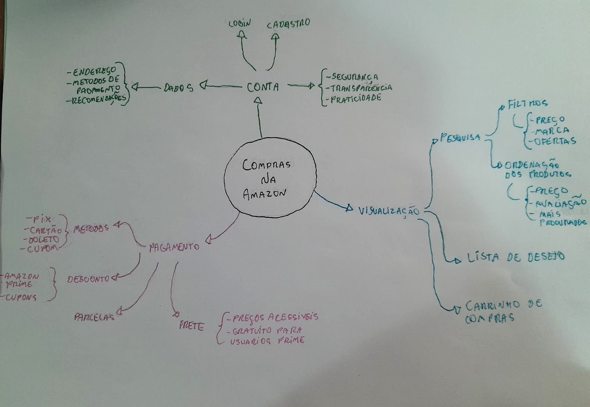
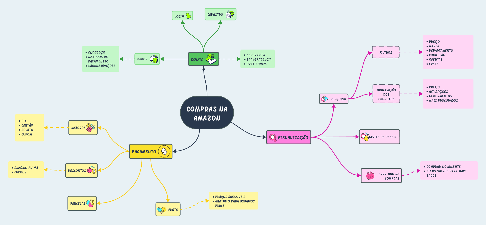

# Mapa Mental

## Introdução

Um mapa mental é uma representação visual que condensa conceitos e pensamentos de maneira gráfica, estabelecendo vínculos entre palavras e imagens que irradiam de um ponto central. Essas representações gráficas são especialmente valiosas para aprimorar a memorização, especialmente quando são criadas manualmente. [¹](#ancora)

## Metodologia

Para a realização do Mapa Mental foram utilizadas algumas regras simples: [¹](#ancora)

1. Começamos escrevendo com a folha na horizontal, pois tínhamos um melhor campo de visão.
2. Escrevemos o título no centro e circulamos.
3. No centro, iniciaram os conceitos mais gerais e os mais específicos nos extremos.
4. Preferimos escrever no sentido horário.
5. Procuramos não usar linhas retas, fizemos linhas curvas. Linhas curvas estimularam mais o cérebro.
6. Variamos muito as cores, deixando o vermelho para lembrar informações negativas.
7. Não fizemos mapas muito grandes ou confusos. Quando tivemos muita informação, escolhemos alguns ramos para fazer novos mapas mentais.
8. Tentamos inserir desenhos ou símbolos coloridos que facilitaram a memorização.
9. Utilizamos letras grandes. 
11. Escrevemos o mínimo possível, dando preferência às palavras-chave que nos ajudaram a lembrar dos conceitos estudados.
12. Fizemos com que nossos desenhos fossem relacionados a palavras, mesmo que isso parecesse absurdo. 

Primeiro fizemos o esboço do mapa mental no papel e após isso passamos para uma versão digital utilizando o site Lucidchart.

## Mapa Mental - Versão Papel

    
    
 Imagem 1: Mapa Mental  Versão Papel (Fonte: Autor, 2023).

## Mapa Mental - Versão Digital

    
    
 Imagem 2: Mapa Mental Versão Digital (Fonte: Autor, 2023).</a>
 

## Requisitos elicitados

Com base no Mapa Mental, foi possível elicitar os seguintes requisitos:

| Legenda | Descrição                                                                                                                                                       | Tipo |
| ------- | --------------------------------------------------------------------------------------------------------------------------------------------------------------- | ---- |
| MM01    | As informações da conta estarem seguras                                                                                                                         | RNF  |
| MM02    | A empresa ser transparente na forma como está utilizando os dados do usuário.                                                                                   | RF   |
| MM03    | O processo de login e cadastro na conta serem práticos                                                                                                          | RNF  |
| MM04    | O site fornecer recomendações de produtos                                                                                                                       | RF   |
| MM05    | Ser possível salvar informações, como endereço e métodos de pagamento, para agilizar a compra.                                                                  | RF   |
| MM06    | Haver diversas formas de pagamento, como PIX, cartão (crédito e débito), boleto e cupons.                                                                       | RF   |
| MM07    | Os usuários do Amazon Prime terem acesso a descontos.                                                                                                           | RF   |
| MM08    | Os usuários do Amazon Prime terem ter acesso a frete grátis.                                                                                                    | RF   |
| MM09    | Existir a possibilidade de parcelar o pagamento.                                                                                                                | RF   |
| MM10    | Haver descontos disponíveis através de cupons.                                                                                                                  | RF   |
| MM11    | Os fretes devem ter preços acessíveis.                                                                                                                          | RF   |
| MM12    | Ser possível usar filtros na pesquisa.                                                                                                                          | RF   |
| MM13    | Ser possível realizar uma ordenação na lista de produtos exibidos.                                                                                              | RF   |
| MM14    | ser possível salvar itens para comprar posteriormente.                                                                                                          | RF   |
| MM15    | No carrinho de compras, ser exibidos os itens previamente adquiridos, tornando mais fácil a compra repetida de um item sem a necessidade de uma busca demorada. | RF   |

 Tabela 1: Requisitos Elicitados (Fonte: Autor, 2023).

### Legenda

| Abreviação | Significado             |
| ---------- | ----------------------- |
| MM         | Mapa Mental             |
| RF         | Requisito Funcional     |
| RNF        | Requisito Não Funcional |

 Tabela 2: Legendas (Fonte: Autor, 2023).

## Referências

> [1] Você sabe criar um mapa mental efetivo?. Disponivel em: [proximosconcursos](https://www.proximosconcursos.com/mapa-mental-efetivo/). Acesso em 5 de set. de 2023.

## Histórico de versão

| Versão | Data       | Descrição                                   | Autor(es) | Revisor(es) |
| ------ | ---------- | ------------------------------------------- | --------- | ----------- |
| `1.0`  | 05/09/2023 | Iniciando o documento                       | Beatriz   | Ana         |
| `1.1`  | 06/09/2023 | Ajuste em modelo do documento               | Beatriz   | Ana         |
| `1.2`  | 07/09/2023 | Adicionando imagens e requisitos elicitados | Beatriz   | Ana         |

