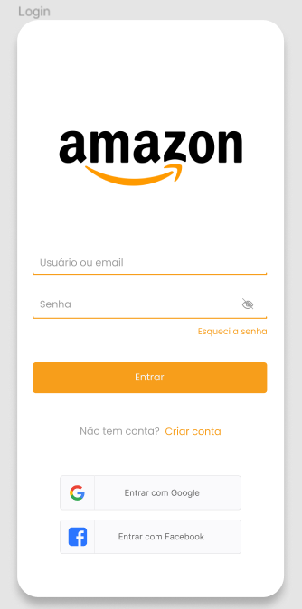

# Protótipo

## Introdução

A validação[¹](#referencias) desempenha um papel fundamental no ciclo de desenvolvimento de software, focalizando-se na 
verificação de se o produto em desenvolvimento está alinhado com as expectativas e requisitos dos 
Stakeholders. Diferente da verificação, que se concentra em assegurar que o software seja construído 
corretamente de acordo com as especificações, a validação está mais centrada em determinar se o software está 
sendo direcionado na direção certa, ou seja, se está atendendo às necessidades apropriadas.

Este processo normalmente envolve a participação direta dos usuários e a avaliação do produto em seu ambiente 
previsto, garantindo que ele cumpra sua finalidade e entregue o valor esperado. A validação pode ser 
conduzida em diversas fases do ciclo de desenvolvimento, como a análise de requisitos, a criação de 
protótipos, interações com os usuários e os testes de aceitação. Isso permite a realização de ajustes e 
melhorias contínuos, visando a eficácia na satisfação das necessidades dos Stakeholders.

## Metodologia

No processo de criação deste artefato, seguimos uma abordagem sistemática, utilizando a técnica de prototipação. Inicialmente, 
identificamos todos os requisitos do aplicativo que ainda não haviam sido implementados, e que possuem alta prioridade de acordo com a 
fase de avaliação. Em seguida, elaboramos um protótipo de baixa fidelidade, isto é, uma versão preliminar do sistema que oferece uma 
representação simplificada das principais funcionalidades.

Essa abordagem permitiu-nos visualizar de forma mais concreta como as funcionalidades-chave do aplicativo poderiam se integrar e funcionar 
em conjunto. Além disso, ao adotar a prototipação de baixa fidelidade, conseguimos realizar ajustes e refinamentos de forma ágil. Isso 
contribui significativamente para a eficiência do processo de criação do protótipo de alta fidelidade, garantindo que as funcionalidades críticas fossem implementadas de 
maneira precisa e satisfatória.

Os requisitos utilizados na modelagem do protótipo podem ser acessados na documentação de priorização: [Backlog](./Backlog.md) e [ThreeLeveScale](./TLS.md)

## Protótipo

O protótipo de baixa fidelidade completo pode ser acessado [Clicando aqui.](https://www.figma.com/file/9kKNJrO3fww3iSyR2JtSsj/Amazon_grupo_1?type=design&node-id=0%3A1&mode=design&t=QoMcsLMrWRjNeNFr-1)

  
Login

  
 
Imagem 1: Tela de login. Fonte: Autoras, 2023
 

  
Cadastro

  
  
Imagem 2: Tela de cadastro. Fonte: Autoras, 2023
 

  
Home

  
  
Imagem 3: Tela Home. Fonte: Autoras, 2023
 

  
Pesquisa

  
  
Imagem 4: Tela de pesquisa. Fonte: Autoras, 2023
 

  
Lista de Desejos

  
  
Imagem 5: Tela da lista de desejos. Fonte: Autoras, 2023
 

  
Visualização de produto

  
  
Imagem 6: Tela de visualização de produto. Fonte: Autoras, 2023
 

  
Carrinho de compras

  
  
Imagem 7: Tela do carrinho de compras. Fonte: Autoras, 2023
 

  
Seleção de pagamento

  
  
Imagem 8: Tela da seleção de pagamento. Fonte: Autoras, 2023
 

  
Pagamento

  
  
Imagem 9: Tela de pagamento. Fonte: Autoras, 2023
 

  
Compra Efetuada

  
  
Imagem 10: Tela de compra efetuada. Fonte: Autoras, 2023
 

## Resultados

Conforme o protótipo e estudos acerca do atual site da Amazon, podemos perceber diversas semelhanças do que foi elicitado e do que já está implementado.

## Referências

[1] UNIVESP. Gerência e Qualidade de Software - Aula 05 - Verificação e Validação. YouTube, 21 jun. 2018. Disponível em: <https://www.youtube.com/watch?v=1Y-1zz6rZxo&t=22s>. Acesso em: 20 jun. 2023

[2] SERRANO, Maurício; SERRANO, Milene. Requisitos - Aula 23. 1º/2019. 53 slides. Material apresentado para a disciplina de Requisitos de Software no curso de Engenharia de Software da UnB, FGA.

[3] Protótipo - Simplenote. Disponível em: <https://requisitos-de-software.github.io/2023.1-Simplenote/analise/validacao/prototipo/>. Acesso em: 14 set. 2023.

## Histórico de versão

| Versão | Data       | Descrição              | Autor(es)            | Revisor(es) |
| ------ | ---------- | ---------------------- | -------------------- | ----------- |
| `1.0`  | 14/09/2023 | Criação do artefato    | Ana Beatriz e Mylena | Kauã        |
| `1.1`  | 14/09/2023 | Add imagens protótipo  | Ana Beatriz e Mylena | Kauã        |
| `2.0`  | 15/09/2023 | Migração para o MkDocs | Arthur               | Gabriel     |
