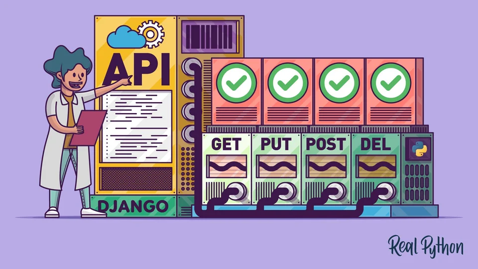
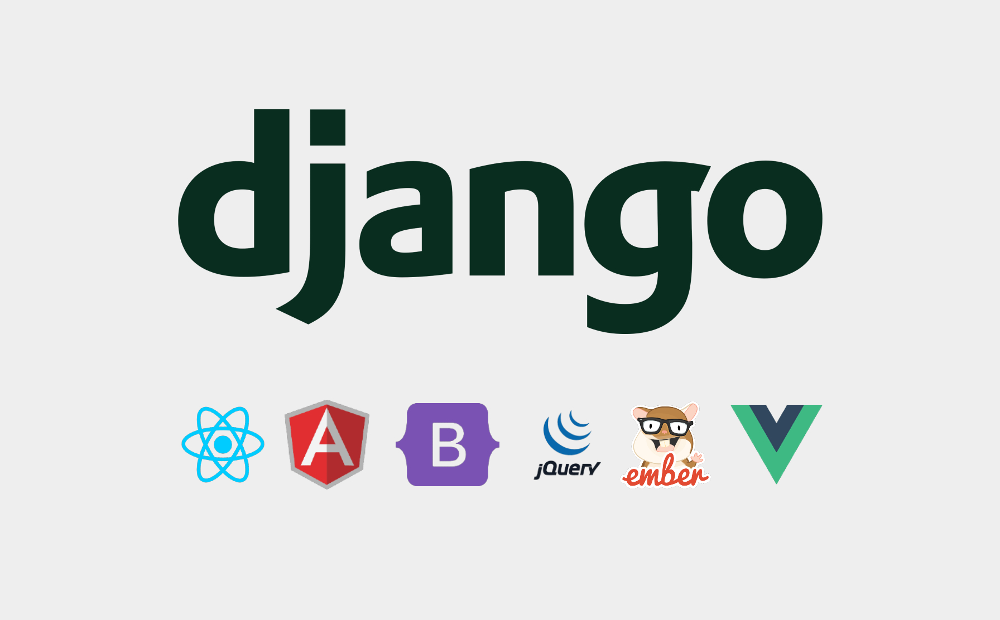
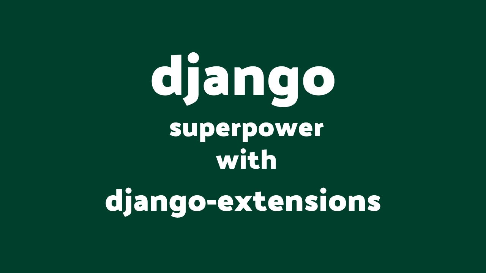

## **Frameworks**

    
    
 Imagem ilustrativa (Fonte: realpython)

Frameworks são uma espécie de esqueleto de uma aplicação que podem ser personalizadas pelo desenvolvedor de software. Tratam-se de bibliotecas de códigos que oferecem facilidades e implementações comuns a várias aplicações. Sua principal função é ajudar no desenvolvimento e agilizar processos, com a reutilização de códigos e a padronização de desenvolvimento.

Com a utilização de um framework, o desenvolvedor não precisa se preocupar em programar determinadas funcionalidades que são comuns na maioria dos projetos, pois o framework já oferece essas funcionalidades prontas para serem utilizadas. Ele fornece uma estrutura básica para a desenvolvimento, permitindo o foco no core da aplicação, ou seja, sua regra de negócio.

Além disso, os frameworks também são responsáveis por conectar sus aplicações com bibliotecas e atuar na automação de tarefas, oferecendo soluções padrões para questões de segurança, acesso a banco de dados, gerenciamento de sessões, manipulação de arquivos, entre outros.

Vale ressaltar que na escolha do framework é importante considerar as necessidades individuais do projeto, conhecimento da equipe de desenvolvimento no framework, comunidade ativa, documentação atualizada e, principalmente, se ele realmente agregar valor naquele projeto específico.

No mundo do desenvolvimento de software, alguns exemplos populares de frameworks incluem: Rails para Ruby, Django para Python, Laravel para PHP, AngularJS, React para JavaScript, entre outros.

## **Tecnologia de Backend - Django**

    

O Django é um framework de desenvolvimento web de alto nível, escrito em Python e seguindo o padrão MVT(Model-View-Template), que incentiva o desenvolvimento rápido e o design limpo e pragmático. O Django alivia muito do trabalho associado a novos projetos, permitindo que desenvolvedores se concentrem na escrita de aplicativos sem a necessidade de reinventar a roda.

O Django oferece recursos robustos para interagir com o banco de dados, como uma interface de ORM (Object-Relational Mapping) que suporta uma ampla variedade de bancos de dados SQL e Non-SQL, e suporte a migrações. Ele também fornece muitas opções para lidar com requisições HTTP, roteamento de URL, templates, autenticação e autorização, além de uma série de outras funcionalidades do lado do servidor.

Devido à sua natureza "batteries-included" (modular e com vários recursos prontos para uso), o Django é uma excelente escolha de tecnologia para o backend, pois permite aos desenvolvedores criar aplicações complexas e eficientes com menos esforço e tempo.

## **Tecnologia de Frontend - Django**

    

Apesar de o Django ser um framework backend, ele possui facilidades que tornam possível o desenvolvimento de aplicações web completas, ou seja, tanto backend quanto frontend. Isso é possibilitado pela camada de Template do padrão MVT (Model-View-Template) - a qual foi projetada para ser flexível, adaptável e de fácil utilização, permitindo, inclusive, a integração com outras linguagens de template.

O sistema de templates do Django foi feito para gerar qualquer formato de texto baseado em templates, com isso é possível utilizar HTML, CSS e JavaScript para construir as interfaces de usuário. Ele inclui uma linguagem de template própria que é utilizada para definir a estrutura das páginas web, permitindo a inclusão de loops, condicionais e a definição de blocos que podem ser substituídos por templates filhos.

O Django também possui suporte a sessões, autenticação e autorização, além de uma série de outras funcionalidades que podem ser usadas direto no frontend.

No entanto, é importante notar que, para aplicações complexas ou que necessitam de muitas interações em tempo real, pode ser mais apropriado usar o Django em conjunto com bibliotecas ou frameworks JavaScript como React ou Angular, devido ao fato de que o Django não foi projetado para ser um framework de frontend.

Em resumo, o Django pode ser utilizado para a renderização frontend, especialmente se você quer rapidez e menos complexidade, porém ele não deve ser a primeira escolha para casos de uso mais avançados de frontend.

## **Tecnologia de Banco de Dados - SQLite**

    

SQLite é uma biblioteca em linguagem C que implementa um pequeno, rápido, autocontido, mecanismo de banco de dados SQL de alta confiabilidade e recursos completos. O SQLite é o mecanismo de banco de dados mais usado no mundo, em termos de implantação. É uma parte integrante de muitas aplicações populares.

SQLite possui diversas características que facilitam o uso no desenvolvimento de aplicações:
- Servidor do banco de dados embutido: o SQLite é "serverless", ou seja, não requer um servidor separado para operar. O SQLite lê e grava diretamente nos arquivos de disco.
- Leve: Um banco de dados SQLite completo com várias tabelas, índices, trigers e views, é contido em um único arquivo de disco. Isso torna o SQLite extremamente portável - você pode copiar um banco de dados simplesmente copiando o arquivo.
- Zero-configuração: Nenhuma configuração ou administração é necessária para usar o SQLite.
    
No Django, SQLite é o banco de dados padrão, ideal para desenvolvimento e prototipagem devido à sua simplicidade de configuração. É possível usar SQLite em produção, porém para aplicações que requerem alto volume de leitura e escrita, outros bancos de dados como PostgreSQL ou MySQL podem ser mais adequados.

Uma grande vantagem do Django é a sua camada de abstração de banco de dados, sendo capaz de trocar o banco de dados praticamente sem mudanças no código.

## **Ferramenta Auxiliar - Django-Extensions**

    

Django-Extensions é uma coleção de extensões personalizadas que adicionam comandos e recursos adicionais ao Django Framework, com o objetivo de facilitar e otimizar o processo de desenvolvimento de aplicações.

Algumas das principais funcionalidades fornecidas pelo Django-Extensions incluem comandos adicionais de linha de comando, modelos e campos adicionais, além de outros utilitários. Os comandos de linha de comando adicionais, por exemplo, ajudam os desenvolvedores a lidar com tarefas como limpar sessões, deletar migrações, entre outros.

O Django-Extensions é altamente respeitado e amplamente utilizado na comunidade Django por sua capacidade de melhorar a eficiência e produtividade, fornecendo uma variedade de ferramentas úteis que complementam a já poderosa estrutura Django.

Para utilizar o Django-Extensions, basta instalá-lo através do gerenciador de pacotes `pip` e adicioná-lo à lista de aplicativos instalados nas configurações do projeto Django. Depois disso, suas funcionalidades estarão disponíveis e prontas para usar em todo o projeto. 

Vale ressaltar que é sempre importante consultar a documentação do Django-Extensions para entender corretamente como cada recurso do pacote funciona e como eles podem ser melhor explorados de acordo com cada cenário de aplicação.

| Versão |    Data    |                Descrição                 |     Autor     |    Revisor    |
| :----: | :--------: | :--------------------------------------: | :-----------: | :-----------: |
| `1.1`  | 30/11/2023 |Criação do documento inicial|  Augusto D. Camargo  |    Arthur F. Rodrigues   |
| `1.2`  | 30/11/2023 |Adição de imagens e finalização do documento|  Augusto D. Camargo  |    Arthur F. Rodrigues   |
