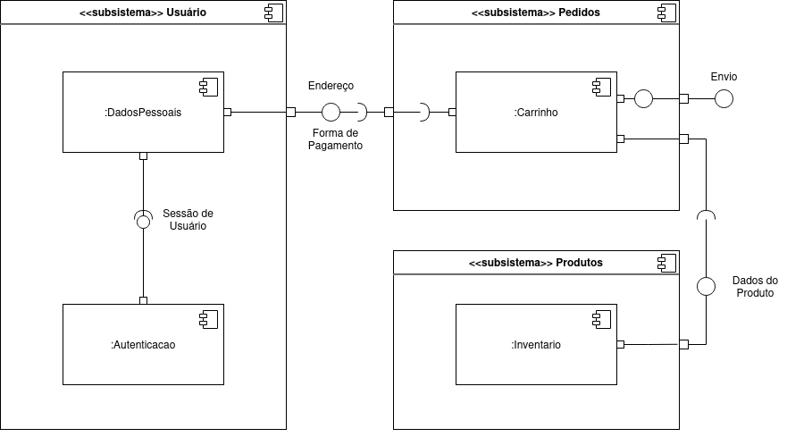
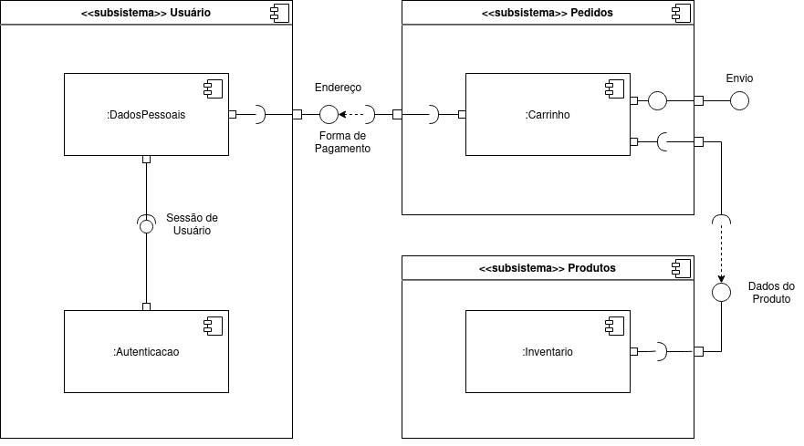
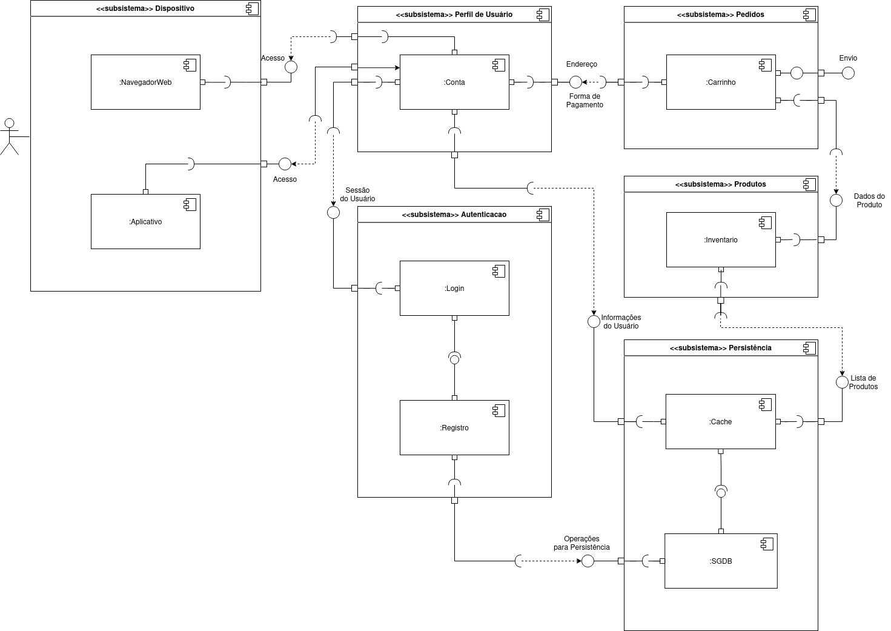

# Diagrama de Componentes

## Introdução

Os Diagramas de Componentes, definidos pela UML 2.0, desempenham um papel
crucial na etapa modelagem de Arquitetura de Software. Esses diagramas
buscam modelar o sistema em termos de componentes e seus relacionamentos
através de interfaces.

Um Diagrama de Componentes é composto por:

1. **Componentes**: Unidades funcionais do sistema, como módulos, classes,
   bibliotecas ou pacotes. São representados de forma gráfica no diagrama.
2. **Interfaces**: Definem o modelo de interação entre os componentes.
3. **Dependências**: Setas direcionais que indicam as relações de dependências
   entre os componentes.
4. **Conexões**: Representam a ligação física ou lógica entre componentes.

## Metodologia

Para elaborar os diagramas, os responsáveis escolheram a plataforma
[draw.io](https://www.drawio.com), devido ao excelente suporte a elementos
presentes em componentes de diagramas.

Os diagramas foram elaborados de maneira iterativa, buscando feedback de outros
integrantes da equipe e também do docente. É importante notar que os materiais
complementares foram de suma importância no processo de construção e evolução
dos diagramas.

## Diagramas

### Versão 1

<figure>
  
  <figcaption>Imagem 1: Versão 1 do Diagrama de Componentes (Fonte: Autor, 2023)</figcaption>
</figure>

### Versão 2

Mudanças pontuais sugeridas pela professora.

<figure>
  
  <figcaption>Imagem 2: Versão 2 do Diagrama de Componentes (Fonte: Autor, 2023)</figcaption>
</figure>

### Versão 3

Mudanças mais estruturais sugeridas pela professora. Essas mudanças aumentam o
grau de granularidade do diagrama e adicionam mais módulos e subsistemas.

<figure>
  
  <figcaption>Imagem 3: Versão 3 do Diagrama de Componentes (Fonte: Autor, 2023)</figcaption>
</figure>

## Referências

> [1] IBM. The Component Diagram. Disponível em: https://developer.ibm.com/articles/the-component-diagram/. Acesso em: 04 de outubro de 2023

## Histório de Versão

| Versão | Data       | Descrição      | Autores         | Revisores          |
| ------ | ---------- | -------------- | --------------- | ------------------ |
| `1.0`  | 04/10/2023 | Diagrama V1    | Guilherme Puida |       Arthur       |
| `2.0`  | 04/10/2023 | Diagrama V2    | Guilherme Puida |       Arthur       |
| `3.0`  | 04/10/2023 | Introdução     | Guilherme Puida |       Arthur       |
| `3.1`  | 04/10/2023 | Metodologia    | Guilherme Puida |       Arthur       |
| `4.0`  | 04/10/2023 | Diagrama V3    | Guilherme Puida |       Arthur       |
