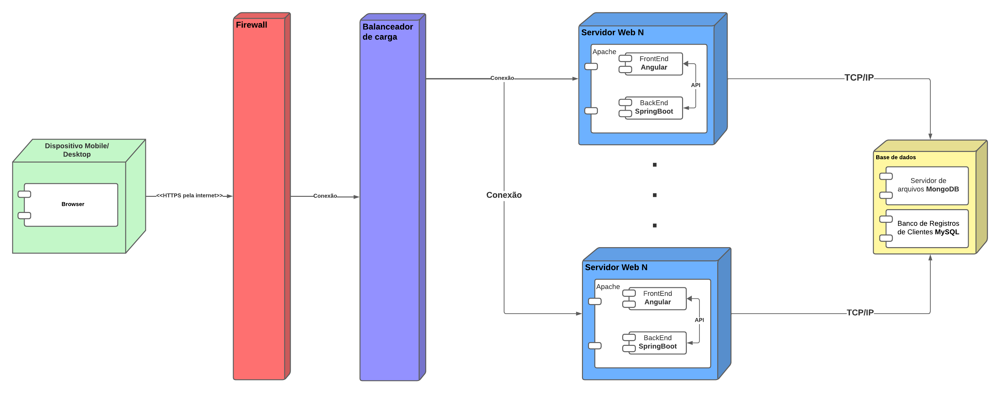

# Diagrama de Implantação

## Introdução

Os diagramas de implantação modela a arquitetura física de um sistema [1]. Ou seja, o ambiente que será executado [3]. Os principais elementos gráficos desse diagrama representam nós e associações. Onde os nós representam dispositivos que realizam algum tipo de processamento, enquanto associações são os relacionamentos entre os nós.

## Metodologia

Para a realização do Diagrama de Implantação foi analisado a arquitetura do site de compras Amazon, podendo visualizar o hardware e software físico do sistema, com o objetivo de entender como funciona a implantação deste sistema no hardware e mostrando a comunicação entre seus dispositivos de processamento.

Para a confecção do diagrama, foi utilizado a plataforma [Lucidchart](https://www.lucidchart.com/), tendo em vista que esta plataforma concede a colaboração em tempo real pelos usuários.

Os membros da equipe responsáveis pela criação do diagrama ([Augusto Camargo](https://github.com/augustocrmg), [Bruno Oliveira](https://github.com/eng-Bruno) e [Samuel Sato](https://github.com/samuel-sato)), realizaram previamente, pesquisas para entender o funcionamento de um Diagrama de Implantação. O material utilizado para a pesquisa está disponível na seção [Referências](#referências). Posteriormente os membros se reuniram em uma chamada via Discord, para discutir os materiais estudados e confeccionar o diagrama em conjunto.

Na criação do diagrama, o sistema foi representado por um dispositivo (desktop ou mobile) que é utilizado pelo usuário para acessar o site, que passa por um firewall (sistema de segurança de rede) que faz conexão a um balanceador de carga, onde o tráfego de rede é dividido entre vários servidores web, após isso é realizado uma conexão entre os servidores e a base de dados do sistema, onde contém os registros dos clientes e o servidor de arquivos do software.

## Diagrama de Implantação

    
    
 Imagem 1 (Fonte: Autor, 2023).</a>

## Referências

> [1] Diagrama de Implementação. Disponível em: <https://www.ibm.com/docs/pt-br/rsas/7.5.0?topic=topologies-deployment-diagrams>. Acesso em: 06 out. 2023.
>
> [2] O que é um diagrama de implementação?. Disponível em: <https://www.lucidchart.com/pages/pt/o-que-e-diagrama-de-implementacao-uml>. Acesso em: 06 out. 2023.
>
> [3] Curso de UML - Diagrama de Implantação. Disponível em: <https://www.youtube.com/watch?v=DgERD0HgggQ>. Acesso em 06 out. 2023.
>
> [4] O Guia Fácil de Diagramas de Implantação UML. Disponível em <https://creately.com/blog/pt/diagrama/tutorial-do-diagrama-de-implantacao/>. Acesso em 06 out. 2023.

‌

## Histórico de versão

| Versão |    Data    |                Descrição                 |         Autor           |    Revisor    |
| :----: | :--------: | :--------------------------------------: | :---------------------: | :-----------: |
| `1.1`  | 06/10/2023 |           Criação do documento           |       Samuel            |               |
| `1.2`  | 07/10/2023 |         Diagrama de Implantação          | Augusto, Bruno e Samuel |               |
| `1.3`  | 08/10/2023 |         Adicionando metodologia          |         Bruno           |               |
